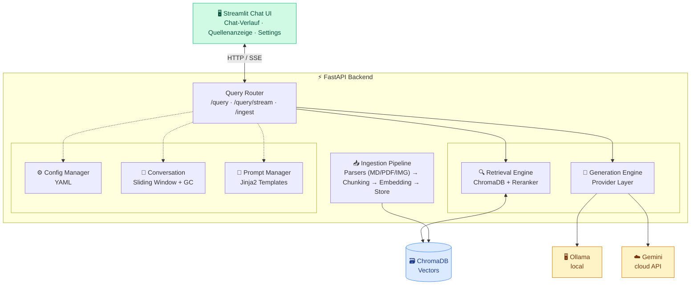
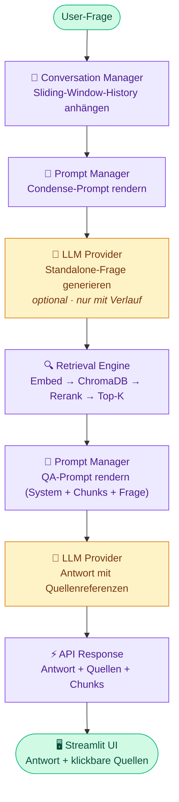

# LoreKeeper — Architecture Document

**RAG-based Q&A System for Structured Worldbuilding Documents**

Version: 0.2.0 — Last Updated: 2026-04-04

> Dieses Dokument beschreibt die Systemarchitektur auf Komponentenebene.
> Für spezialisierte Themen siehe die detaillierten Docs:
>
> | Thema | Dokument |
> |-------|----------|
> | Ingestion- & Query-Pipeline | [docs/data-flow.md](docs/data-flow.md) |
> | Embedding-Aufbau & Reranking | [docs/embedding-strategy.md](docs/embedding-strategy.md) |
> | Ollama vs. Gemini, Provider-Wechsel | [docs/provider-strategy.md](docs/provider-strategy.md) |
> | Streamlit UI, Session-State | [docs/ui-ux.md](docs/ui-ux.md) |
> | Ingest, Troubleshooting, Docker | [docs/operations.md](docs/operations.md) |

---

## Inhaltsverzeichnis

1. [Vision & Zielsetzung](#1-vision--zielsetzung)
2. [Systemübersicht](#2-systemübersicht)
3. [Repository-Struktur](#3-repository-struktur)
4. [Komponenten im Detail](#4-komponenten-im-detail)
   - 4.1 Document Ingestion Pipeline
   - 4.2 Embedding & Vector Store
   - 4.3 Retrieval Engine
   - 4.4 Generation Engine & Provider-Abstraction
   - 4.5 Conversation Manager
   - 4.6 Prompt Manager
   - 4.7 Config Manager
   - 4.8 API Layer
   - 4.9 Streamlit Chat UI
5. [Konfiguration](#5-konfiguration)
   - 5.1 settings.yaml
   - 5.2 prompts.yaml
6. [Hardware-Profile & Modellempfehlungen](#6-hardware-profile--modellempfehlungen)
7. [Evaluation](#7-evaluation)
8. [Deployment & Infrastruktur](#8-deployment--infrastruktur)
9. [Erweiterbarkeit & Roadmap](#9-erweiterbarkeit--roadmap)
10. [Tech Stack Zusammenfassung](#10-tech-stack-zusammenfassung)

---

## 1. Vision & Zielsetzung

LoreKeeper ist ein modulares Retrieval-Augmented Generation (RAG) System, das strukturierte
Worldbuilding-Dokumente (Lore, Charakterbeschreibungen, Fraktionen, Regionen, Regeln etc.)
indiziert und über eine Chat-Oberfläche durchsuchbar und abfragbar macht.

### Kernziele

- Natürlichsprachliche Fragen über eine PnP-Welt beantworten, gestützt auf die tatsächlichen Quellen
- Quellenangabe bei jeder Antwort (Dokument, Abschnitt, Heading)
- Konversationsgedächtnis über mehrere Nachrichten (Sliding Window)
- Lokale und Cloud-basierte LLM-Nutzung (Ollama / Gemini) über einen einheitlichen Provider-Layer
- Modularer Aufbau, zentral konfigurierbar über YAML, erweiterbar
- Deutschsprachig als Primärsprache, englische Queries als spätere Option

### Nicht im Scope (v1)

- Multimodale Bildbeschreibung / Vision (Bilder werden als Metadaten indiziert, nicht analysiert)
- React-Frontend (kommt nach Streamlit als v2)
- Cloud-Deployment (läuft lokal + Docker)
- Schreibzugriff auf Dokumente (read-only)
- Fine-Tuning von Modellen

---

## 2. Systemübersicht



### Datenfluss einer Query



---

## 3. Repository-Struktur

```
lorekeeper/
│
├── config/
│   ├── settings.yaml              # Zentrale Konfiguration
│   ├── prompts.yaml               # Aktive Prompt-Templates
│   └── prompts/                   # Gespeicherte Prompt-Varianten (*.yaml)
│
├── src/
│   ├── __init__.py
│   ├── main.py                    # FastAPI App Entry Point
│   │
│   ├── config/
│   │   ├── __init__.py
│   │   └── manager.py             # YAML Loader + Pydantic Validation
│   │
│   ├── ingestion/
│   │   ├── __init__.py
│   │   ├── orchestrator.py        # Koordiniert: Parse → Chunk → Embed → Store
│   │   ├── parsers/
│   │   │   ├── __init__.py
│   │   │   ├── base.py            # Abstract Base Parser
│   │   │   ├── markdown.py        # Markdown (Frontmatter, Headings, Links)
│   │   │   ├── pdf.py             # PDF (PyMuPDF / pymupdf4llm)
│   │   │   └── image.py           # Bild-Metadaten (Dateiname, Pfad, Ordner)
│   │   └── chunking.py            # Chunking-Strategien
│   │
│   ├── retrieval/
│   │   ├── __init__.py
│   │   ├── embeddings.py          # sentence-transformers Wrapper
│   │   ├── vectorstore.py         # ChromaDB Interface (CRUD, Query, Filter)
│   │   └── retriever.py           # Retrieval-Logik + Metadaten-Filtering
│   │
│   ├── generation/
│   │   ├── __init__.py
│   │   ├── providers/
│   │   │   ├── __init__.py
│   │   │   ├── base.py            # Abstract Base Provider (Interface)
│   │   │   ├── ollama.py          # Ollama Client (OpenAI-kompatible API)
│   │   │   └── gemini.py          # Google Gemini Client (google-genai SDK)
│   │   ├── provider_factory.py    # Factory: Config → Provider-Instanz
│   │   └── generator.py           # Orchestriert Prompt + LLM + Response-Parsing
│   │
│   ├── conversation/
│   │   ├── __init__.py
│   │   └── manager.py             # Sliding Window, Session-Verwaltung
│   │
│   ├── prompts/
│   │   ├── __init__.py
│   │   └── manager.py             # Lädt + rendert Templates via Jinja2
│   │
│   └── api/
│       ├── __init__.py
│       ├── routes.py               # Endpoints: /query, /query/stream, /ingest, /ingest/status, /health, /sessions
│       ├── schemas.py              # Pydantic Request/Response Models
│       ├── prompt_routes.py        # Endpoints: /prompts/* (active, variants, preview)
│       ├── prompt_schemas.py       # Pydantic Models für Prompt-Endpoints
│       └── eval_routes.py          # Endpoints: /eval/*
│
├── ui/
│   ├── LoreKeeper.py              # Streamlit Chat-Oberfläche
│   └── pages/
│       ├── 1_Sources.py            # Source-Verwaltung
│       ├── 2_Evaluation.py         # Evaluation-Seite
│       └── 3_Prompts.py            # Prompt-Editor + Varianten
│
├── evaluation/
│   ├── qa_pairs.yaml              # Golden Set: 40 Fragen (markdown/pdf/image/adventure)
│   ├── evaluate.py                # End-to-End Evaluation (inkl. LLM via /query)
│   ├── evaluate_retrieval.py      # Retrieval-Only Evaluation (kein LLM, schnell)
│   └── results/                   # Ergebnisse als JSON
│
├── data/
│   └── .gitkeep                   # Dokumente werden NICHT committed
│
├── chroma_data/
│   └── .gitkeep                   # ChromaDB Persistenz (NICHT committed)
│
├── docker-compose.yaml            # API + ChromaDB + Ollama
├── Dockerfile                     # API + Backend
├── Dockerfile.ui                  # Streamlit UI (separater Container)
├── requirements.txt
├── pyproject.toml
├── .env.example                   # Environment-Variablen Template
├── ARCHITECTURE.md
└── README.md
```

---

## 4. Komponenten im Detail

### 4.1 Document Ingestion Pipeline

**Aufgabe:** Dokumente einlesen, parsen, chunken, embedden, in ChromaDB persistieren.

#### Dokumentquellen

Sources werden in `config/sources.yaml` (Sidecar, gitignored) konfiguriert.
Eine Source ist entweder ein **Ordner** oder eine **einzelne Datei**. Jede
Source hat eine `group` (`lore` / `adventure` / `rules`) als Fallback für die
UI-Filter „🗺️ Lore / 📖 Abenteuer / 📋 Regelwerk". Über `category_map`
kann die `group` **pro Top-Level-Ordner** überschrieben werden — so lässt sich
ein einzelner Obsidian-Vault sauber auf alle drei Gruppen verteilen.

```yaml
# config/sources.yaml
sources:
  - id: pnp-welt                         # stabile ID — wird für Reindex/Delete benutzt
    path: C:/Users/you/Obsidian/PnP-Welt  # beliebiger absoluter oder relativer Pfad
    group: lore                          # Fallback-Group für unmapped Ordner
    default_category: misc               # Fallback-Kategorie
    category_map:
      NPCs: npc                          # String-Kurzform → erbt group: lore
      Orte: location
      Gegner: enemy
      Geschichte:                        # Dict-Form → überschreibt group
        category: story
        group: adventure
      Regelwerk:
        category: rules
        group: rules
```

`config/settings.yaml → ingestion.supported_formats / exclude_patterns` bleiben
global. `ingestion.document_paths` ist **deprecated**: wenn `sources.yaml` fehlt
und `document_paths` gesetzt ist, baut der ConfigManager beim Start automatisch
einen Migrations-Shim (alle Pfade → `group=lore`) und loggt eine Warnung.

**Sources verwalten** geht entweder per Editor (`config/sources.yaml`), per
REST (`GET/PUT /sources`, `POST /sources/{id}/reindex`, `DELETE /sources/{id}`,
`POST /sources/recategorize`, `POST /admin/wipe`) oder über die Streamlit-Seite
**⚙ Sources** (siehe `ui/pages/`).

**Recategorize** (`python -m src.ingestion.recategorize` bzw. UI-Button) wendet
geänderte `category_map` / `group`-Werte auf bestehende Chunks an, ohne neu zu
embedden — sekundenschnell, da nur Metadata-Update.

#### Parser-Strategie

Jeder Parser implementiert das `BaseParser`-Interface:

```python
class BaseParser(ABC):
    @abstractmethod
    def can_parse(self, file_path: Path) -> bool: ...

    @abstractmethod
    def parse(self, file_path: Path) -> list[ParsedDocument]: ...
```

| Dateityp   | Parser            | Strategie                                                          |
|------------|-------------------|--------------------------------------------------------------------|
| `.md`      | `MarkdownParser`  | Obsidian-Vault-Format: YAML-Frontmatter (inkl. `aliases`),        |
|            |                   | Heading-Hierarchie, `[[Wikilinks]]` als Metadaten-Referenzen,     |
|            |                   | `![[Bild.png]]`-Embeds entfernen, Callouts (`> [!abstract]`)      |
|            |                   | als normalen Text behandeln, Obsidian-Tags (`#NPC`) extrahieren   |
| `.pdf`     | `PDFParser`       | PyMuPDF (`pymupdf4llm`) konvertiert PDF zu Markdown; Splitting     |
|            |                   | erfolgt heading-aware (identisch zu `MarkdownParser`), nicht       |
|            |                   | seitenweise — Abschnitte bleiben thematisch zusammenhängend        |
| `.png/jpg` | `ImageMetaParser` | Dateiname + vollständige Ordnerhierarchie ab Vault-Root als        |
|            |                   | durchsuchbarer Text. Kein Bildinhalt-Parsing in v1.                |

> **Obsidian-spezifische Syntax im `MarkdownParser`:**
> - `[[Link]]` und `[[Link|Alias]]` → als `wikilinks: ["Link"]` Metadaten speichern, aus dem Chunk-Text entfernen oder als plain Text erhalten
> - `![[Bild.png]]` → aus dem Text entfernen (Bild wird separat über `ImageMetaParser` indiziert)
> - `> [!abstract]`, `> [!info]` etc. → Callout-Syntax entfernen, Inhalt als normalen Paragraphen behandeln
> - `#Tag` am Zeilenende → als `obsidian_tags: ["NPC", "Ort"]` Metadaten extrahieren
> - `aliases:` im YAML-Frontmatter → als zusätzliche Suchbegriffe in Metadaten speichern

#### Chunking

```yaml
# settings.yaml
chunking:
  strategy: heading_aware       # heading_aware | recursive | fixed_size
  max_chunk_size: 256           # geschätzte Tokens (~900 Zeichen Fließtext)
  chunk_overlap: 30             # nur für Fließtext; Tabellen erhalten kein Overlap
  min_chunk_size: 20            # Chunks darunter werden mit Vorgänger gemerged —
                                # aber nur innerhalb derselben heading_hierarchy.
                                # Cross-heading-Merges würden die Heading-Metadaten
                                # über den halben Inhalt lügen lassen.
```

> **Token-Schätzung:** `_estimate_tokens()` rechnet `len(text) / 3.5` (Zeichen pro Token).
> Für Deutsch sind ~3,5 Zeichen/Token realistisch (Komposita → viele Subwörter).
> `max_chunk_size: 256` entspricht ~900 Zeichen Fließtext. Mit Identity-Line und
> Heading-Prefix bleibt der Embed-Text zuverlässig unter dem 512-Token-Limit von
> `intfloat/multilingual-e5-base`.
>
> **Table-aware Chunking:** Markdown-Tabellen (Zeilen die mit `|` beginnen) werden
> als atomare Einheiten behandelt — kein Overlap, kein Split mitten in eine Zeile.
> Sehr große Tabellen werden nur an Zeilengrenzen gesplittet, mit wiederholtem Header.

**Heading-Aware Chunking (Default für Markdown und PDF):**
- Jede Überschriften-Sektion wird ein eigener Chunk
- Bei Überschreitung von `max_chunk_size`: Recursive Character Split mit Overlap
- Heading-Hierarchie wird als Metadaten erhalten (`["Regionen", "Nordlande", "Klima"]`)

**Recursive Character Splitting:**
- Trennzeichen-Hierarchie: `\n\n` → `\n` → `. ` → ` `

#### Chunk-Metadaten

Jeder Chunk erhält Metadaten für Retrieval-Filterung und Quellenangabe:

```python
{
    "source_file": "characters/aldric.md",      # Relativer Pfad
    "source_path": "/abs/path/characters/aldric.md",
    "document_type": "markdown",                 # markdown | pdf | image
    "heading_hierarchy": ["Charaktere", "Aldric", "Hintergrund"],
    "chunk_index": 3,                            # Position im Dokument
    "total_chunks": 7,
    "content_category": "npc",                   # Aus Ordnerstruktur (siehe Mapping unten)
    "last_modified": "2026-03-15T14:30:00",      # Für inkrementelle Re-Ingestion
    "content_hash": "sha256:abc123...",          # SHA-256 des Quelldokuments
    "obsidian_tags": ["NPC", "DunkleMagie"],     # Aus #Tags am Dateiende
    "aliases": ["Malek", "Der Monarch"],         # Aus YAML-Frontmatter aliases:
    "wikilinks": ["Schwarzer Monolith", "Schattenorden"],  # [[Wikilinks]] aus dem Text
    "source_collection": "pnp_welt"             # Herkunfts-Pfad-Alias
}
```

#### `content_category`-Mapping aus Ordnerstruktur

Der Wert wird aus dem **obersten** Ordnernamen unterhalb des jeweiligen `document_path`-Roots abgeleitet:

| Ordner                   | `content_category`   | UI-Gruppe       |
|--------------------------|----------------------|-----------------|
| `PnP-Welt/NPCs/`         | `npc`                | 🗺️ Lore         |
| `PnP-Welt/Orte/`         | `location`           | 🗺️ Lore         |
| `PnP-Welt/Gegner/`       | `enemy`              | 🗺️ Lore         |
| `PnP-Welt/Gegenstände/`  | `item`               | 🗺️ Lore         |
| `PnP-Welt/Organisationen/` | `organization`     | 🗺️ Lore         |
| `PnP-Welt/Dämonen/`      | `daemon`             | 🗺️ Lore         |
| `PnP-Welt/Götter/`       | `god`                | 🗺️ Lore         |
| `PnP-Welt/Backstorys/`   | `backstory`          | 🗺️ Lore         |
| `PnP-Welt/Geschichte - *`| `story`              | 📖 Abenteuer    |
| `PnP-Welt/Spielleiter-Tools/` | `tool`          | 📋 Regelwerk    |
| `rules/`                 | `rules`              | 📋 Regelwerk    |
| *(unbekannt)*            | `misc`               | 🗺️ Lore         |

> Die UI-Gruppen (🗺️ Lore / 📖 Abenteuer / 📋 Regelwerk) in `ui/LoreKeeper.py` filtern direkt
> auf diese `content_category`-Werte via ChromaDB-Metadaten-Filter.

#### Inkrementelle Re-Ingestion

Beim erneuten Ausführen werden nur geänderte Dateien neu indiziert:

1. **Content-Hash + Timestamp:** Pro Datei wird ein SHA-256-Hash des Inhalts gespeichert.
   Änderungserkennung prüft primär den Hash (robust gegen Timestamp-Unzuverlässigkeit bei
   externen Repos / Windows-Mounts), fällt auf `last_modified` zurück wenn Hash fehlt.
2. Geänderte Dateien: Alte Chunks löschen → neu parsen → neu embedden → speichern
3. Gelöschte Dateien: Verwaiste Chunks aus ChromaDB entfernen
4. Neue Dateien: Normal verarbeiten

```python
# Chunk-Metadaten ergänzt um:
{
    "content_hash": "sha256:abc123...",    # Hash des Quelldokuments
    ...
}
```

---

### 4.2 Embedding & Vector Store

#### Embedding-Modell

```yaml
# settings.yaml
embeddings:
  model: "intfloat/multilingual-e5-base"
  device: "cpu"             # cpu | cuda | auto
  batch_size: 64
  normalize: true
```

**Modellwahl:** `intfloat/multilingual-e5-base` bietet:
- 768-dimensionale Embeddings
- 512-Token-Kontextfenster (4× mehr als MiniLM)
- Asymmetrisches Retrieval-Training: Query-Prefix `"query: "`, Passage-Prefix `"passage: "`
- Starke Deutsch-Performance auf MIRACL/MTEB-Benchmarks
- ~1.1 GB Modellgröße, läuft auf CPU und Laptop

> **e5-Prefixes:** `EmbeddingService` erkennt e5-Modelle automatisch via Modellname
> und setzt `"query: "` für Suchanfragen und `"passage: "` für Dokumente.
> Ohne diese Prefixes verliert das Modell einen wesentlichen Teil seiner Retrieval-Qualität.

> **Achtung Async:** `sentence-transformers.encode()` ist synchron und CPU-bound
> (PyTorch). Direkter Aufruf im FastAPI-Request-Handler blockiert den asyncio-Event-Loop
> und hängt alle parallelen Anfragen. Alle `encode()`-Aufrufe in `src/retrieval/embeddings.py`
> **müssen** via `fastapi.concurrency.run_in_threadpool` in einen Thread-Pool ausgelagert werden:
>
> ```python
> from fastapi.concurrency import run_in_threadpool
> embedding = await run_in_threadpool(self.model.encode, text)
> ```

#### ChromaDB — Embedded vs. Client/Server

ChromaDB wird in zwei verschiedenen Modi betrieben, je nach Umgebung:

| Modus        | Wann              | Beschreibung                                              |
|--------------|-------------------|-----------------------------------------------------------|
| `embedded`   | Lokal (Windows)   | Chroma läuft als Library direkt im FastAPI-Prozess.       |
|              |                   | Zugriff auf `./chroma_data` via SQLite. Kein extra Prozess. |
| `client`     | Docker            | Chroma läuft als eigener Container. FastAPI kommuniziert  |
|              |                   | über HTTP (`http://chromadb:8000`). Kein `persist_directory`. |

> **Wichtig:** Beide Modi dürfen **nicht** gleichzeitig auf dasselbe `chroma_data`-Verzeichnis
> zugreifen (File-Lock / SQLite-Korruption). Im Docker-Betrieb greift ausschließlich
> der chromadb-Container auf das Volume zu; der FastAPI-Container spricht per HTTP.

```yaml
# settings.yaml
vectorstore:
  provider: chroma
  mode: embedded              # embedded | client  (via Env-Var CHROMA_MODE überschreibbar)
  persist_directory: ./chroma_data   # nur für mode: embedded (lokal)
  chroma_host: chromadb              # nur für mode: client (Docker)
  chroma_port: 8000                  # nur für mode: client (Docker)
  collection_name: lorekeeper
  distance_metric: cosine            # cosine | l2 | ip
```

**Umgebungs-Umschaltung:** Im Docker Compose wird `CHROMA_MODE=client` als
Environment-Variable gesetzt — kein manuelles Editieren der `settings.yaml` nötig.

**Warum ChromaDB:**
- Embedded für lokale Entwicklung (kein separater Prozess), Client für Docker-Isolation
- Persistenz auf Disk
- Metadaten-Filterung (nach `content_category`, `source_collection` etc.)
- Python-native, minimale Abhängigkeiten

---

### 4.3 Retrieval Engine

```yaml
# settings.yaml
retrieval:
  top_k: 15                         # Bi-Encoder-Kandidaten aus ChromaDB (Recall-Pool)
  score_threshold: 0.5              # Minimum Cosine-Score. 0.5 ≈ "ähnlich",
                                    # 0.3 wäre fast orthogonal. Für DE-Worldbuilding-Docs
                                    # ist 0.5–0.6 ein realistischer Default.
  reranking:
    enabled: true                   # Cross-Encoder Reranking (Stage 2)
    model: "cross-encoder/mmarco-mMiniLMv2-L12-H384-v1"   # multilingual
    top_k_rerank: 8                 # Finale Chunks für den LLM
    max_per_source: 3               # Soft cap auf Chunks pro Source-File (0 = unlimited).
                                    # Zwei-Pass-Verfahren nach dem Reranking:
                                    #   Pass 1 — diverse fill: pro File max. N Chunks
                                    #     in Score-Reihenfolge; Cap-blockierte Chunks
                                    #     wandern in eine Overflow-Liste.
                                    #   Pass 2 — backfill: falls top_k_rerank nicht
                                    #     erreicht wurde (Pool zu dünn), werden die
                                    #     besten Overflow-Chunks nachgezogen.
                                    # Diversität ist also eine Präferenz, kein
                                    # Slot-Killer — der Retriever liefert nie weniger
                                    # als top_k_rerank, solange Kandidaten da sind.
```

Diese Werte sind pro Request über die `QueryRequest`-Felder `top_k`,
`top_k_rerank` und `max_per_source` überschreibbar — die Streamlit-UI
exponiert sie als drei gekoppelte Slider im „⚙️ Erweitert:
Retrieval-Tuning"-Expander (`max_per_source = 0` deaktiviert den Cap
komplett für diesen Request).

**Ablauf:**

1. Query wird embedded (gleiches Modell wie Dokumente)
2. ChromaDB Similarity Search → Top-K Chunks
3. Optional: Metadaten-Filter (nur bestimmte Kategorien/Quellen)
4. Score-Threshold Filterung (irrelevante Chunks raus)
5. Reranking via Cross-Encoder (Score-sortierte Liste)
6. **Soft per-source cap** (`max_per_source`):
   - Pass 1 (diverse fill): pro Source-File max. N Chunks akzeptieren,
     Cap-Überlauf in Overflow-Liste parken
   - Pass 2 (backfill): falls `top_k_rerank` nicht erreicht, Overflow
     in Score-Reihenfolge nachziehen
   - Final-Re-Sort nach Reranker-Score, damit der LLM die relevantesten
     Chunks zuerst sieht
7. Rückgabe: Chunks + Metadaten + Scores

---

### 4.4 Generation Engine & Provider-Abstraction

#### Provider-Interface

```python
class BaseLLMProvider(ABC):
    @abstractmethod
    async def generate(self, prompt: str, **kwargs) -> LLMResponse: ...

    @abstractmethod
    async def generate_stream(self, prompt: str, **kwargs) -> AsyncGenerator[str, None]:
        """Yields token-by-token für SSE-Streaming."""
        ...

    @abstractmethod
    async def health_check(self) -> bool: ...
```

Rückgabe-Schema:

```python
@dataclass
class LLMResponse:
    content: str
    model: str
    provider: str
    usage: dict             # tokens_in, tokens_out, latency_ms
    raw_response: dict      # Provider-spezifische Rohdaten
```

> **Streaming-Hinweis:** Ollama unterstützt Streaming nativ über `/api/chat` mit
> `"stream": true`. Gemini über `stream=True` im google-genai SDK. Beide Provider
> implementieren `generate_stream()` als `AsyncGenerator[str, None]`
> (`from typing import AsyncGenerator`).

#### Ollama Provider

```yaml
# settings.yaml
llm:
  provider: ollama                       # ollama | gemini
  ollama:
    base_url: "http://localhost:11434"
    model: "qwen3:8b"
    temperature: 0.3
    top_p: 0.9
    max_tokens: 1024
    timeout: 120
```

Kommunikation über die OpenAI-kompatible API von Ollama (`/v1/chat/completions`).
Vorteil: Falls später ein OpenAI-kompatibler Provider dazukommt, ist die Integration
trivial.

#### Gemini Provider

```yaml
# settings.yaml
llm:
  provider: gemini
  gemini:
    model: "gemini-2.0-flash"
    api_key_env: "GEMINI_API_KEY"       # Aus .env geladen
    temperature: 0.3
    top_p: 0.9
    max_tokens: 1024
    timeout: 30
```

Nutzt das `google-genai` SDK. API-Key-Auflösung in dieser Reihenfolge:

1. **Runtime-Override** (Process-lokal, gesetzt via `POST /provider/gemini/key` aus der UI)
2. `os.environ[api_key_env]`
3. `.env`-Datei

Der Runtime-Override wird **nicht** auf Disk persistiert — er überlebt keinen
Backend-Neustart. Das ist Absicht: das ermöglicht "Programm starten → Key in der
UI eintragen → loslegen" ohne `.env` anfassen zu müssen, schreibt aber keine
Secrets in versionierte oder unversionierte Dateien. Statusabfrage über
`GET /provider/gemini/status` liefert nur `{has_key, source: env|runtime|none}`,
niemals den Key selbst. Wird Gemini gerade als aktiver Provider benutzt, baut
der `POST`-Endpoint Provider + `Generator` direkt neu, sodass der neue Key sofort
greift.

#### Provider Factory

```python
class ProviderFactory:
    @staticmethod
    def create(config: LLMConfig) -> BaseLLMProvider:
        match config.provider:
            case "ollama":
                return OllamaProvider(config.ollama)
            case "gemini":
                return GeminiProvider(config.gemini)
            case _:
                raise ValueError(f"Unknown provider: {config.provider}")
```

Umschalten zwischen Ollama und Gemini: Eine Zeile in `settings.yaml` ändern
oder via Environment-Variable `LLM_PROVIDER=gemini` überschreiben.

#### `condense_model` — zweite Provider-Instanz

Wenn `conversation.condense_model` gesetzt ist, erstellt die `ProviderFactory` eine
zweite Ollama-Instanz **mit demselben `base_url`**, aber dem alternativen Modellnamen.
`condense_model` ist immer ein Ollama-Modellname — ein anderer Provider als Ollama für
Condense wird in v1 nicht unterstützt.

```python
# src/generation/provider_factory.py
if config.conversation.condense_model:
    condense_provider = OllamaProvider(
        base_url=config.llm.ollama.base_url,
        model=config.conversation.condense_model,
    )
```

Wenn `condense_model: null`, übernimmt der Haupt-LLM-Provider auch das Condense.

#### Fallback-Logik (optional, konfigurierbar)

```yaml
# settings.yaml
llm:
  provider: ollama
  fallback_provider: gemini             # Bei Ollama-Fehler → Gemini
  fallback_enabled: true
```

---

### 4.5 Conversation Manager

**Aufgabe:** Chat-Verlauf pro Session verwalten, Sliding Window pflegen, Standalone-Frage
generieren.

```yaml
# settings.yaml
conversation:
  window_size: 8                        # Anzahl Nachrichten-Paare (User + Assistant)
  max_context_tokens: 4096              # Hard Limit für History-Tokens
  condense_question: true               # History + Frage → Standalone-Frage via LLM
  condense_model: null                  # null = selbes Modell wie llm.provider.
                                        # Optional: schnelleres Modell nur für Condense,
                                        # z.B. "qwen3:8b" (Ollama).
                                        # Spart ~50 % Latenz pro Folgefrage.
  session_timeout_minutes: 60           # Session nach Inaktivität verwerfen
  session_gc_interval_seconds: 300      # Wie oft der Background-GC läuft (alle 5 min)
```

**Sliding Window Strategie:**

- Die letzten `window_size` Message-Paare werden beibehalten
- Ältere Nachrichten werden verworfen (kein Summarization in v1)
- `max_context_tokens` als Hard Limit: Falls 8 Paare das Limit überschreiten,
  werden von vorne weitere Paare entfernt
- Sweet Spot von 8 Paaren basiert auf dem Tradeoff: Kleine Modelle (8-14B)
  zeigen ab ~4-6K Tokens Kontextlänge das "Lost in the Middle"-Problem —
  relevante Informationen in der Mitte des Kontexts werden schlechter verarbeitet.
  8 Paare halten den Gesamtkontext (History + Retrieved Chunks + Prompt) im
  effektiven Bereich.

**Condense Question (Question Rewriting):**

Bei aktiviertem `condense_question` wird die aktuelle Frage im Kontext der
Chat-History zu einer Standalone-Frage umgeschrieben, bevor sie für Retrieval
verwendet wird:

```
User: "Erzähl mir über Aldric"
Assistant: "Aldric ist ein Krieger aus den Nordlanden..."
User: "Welche Feinde hat er?"
→ Condensed: "Welche Feinde hat der Krieger Aldric aus den Nordlanden?"
```

Das verbessert die Retrieval-Qualität erheblich, da die Standalone-Frage
ohne Konversationskontext sinnvolle Embeddings erzeugt.

**Session-Verwaltung:**

- Sessions werden in-memory verwaltet (dict mit Session-ID als Key)
- Kein Persistieren von Sessions über Neustarts (Streamlit State reicht)
- Session-Timeout nach konfigurierbarer Inaktivität

**Session Garbage Collection (Background Task):**

Ein `asyncio`-Background-Task im FastAPI `lifespan`-Context läuft alle
`session_gc_interval_seconds` und entfernt abgelaufene Sessions aus dem Dict.
Ohne diese explizite GC ist `session_timeout_minutes` wirkungslos und der
RAM läuft bei längerer Laufzeit voll.

```python
# src/conversation/manager.py (Skizze)
async def _gc_loop(self):
    while True:
        await asyncio.sleep(self.config.session_gc_interval_seconds)
        now = datetime.utcnow()
        expired = [
            sid for sid, s in self._sessions.items()
            if (now - s.last_active).seconds / 60 > self.config.session_timeout_minutes
        ]
        for sid in expired:
            del self._sessions[sid]
```

---

### 4.6 Prompt Manager

**Aufgabe:** Alle Prompts zentral in `prompts.yaml` verwalten, via Jinja2 rendern.
Prompts können zur Laufzeit über die UI oder die `/prompts/*` API-Endpoints
bearbeitet und hot-reloaded werden — kein Neustart nötig.

```python
class PromptManager:
    def __init__(self, prompts_dict: dict):
        self.templates = prompts_dict
        self.jinja_env = Environment()

    def render(self, template_name: str, **kwargs) -> str:
        template = self.jinja_env.from_string(self.templates[template_name])
        return template.render(**kwargs)
```

**Hot-Reload:** Beim Speichern über die UI/API wird `config/prompts.yaml`
geschrieben und der globale `PromptManager` in `src.main` durch eine neue
Instanz ersetzt — analog zum Provider-Switching.

**Varianten:** Neben den aktiven Prompts können benannte Varianten in
`config/prompts/` als YAML gespeichert, geladen, editiert und aktiviert werden.
Jede Variante enthält die gleichen vier Template-Keys plus einen optionalen
`_meta`-Key (Name, Beschreibung). Beim Aktivieren wird die Variante nach
`prompts.yaml` kopiert und der PromptManager neu geladen.

**Template-Typen (siehe Abschnitt 5.2 für vollständige Templates):**

| Template           | Zweck                                                    |
|--------------------|----------------------------------------------------------|
| `system`           | System-Prompt: Rolle, Sprache, Antwortformat             |
| `qa`               | Hauptprompt: Context-Chunks + Frage → Antwort            |
| `condense`         | History + Follow-Up → Standalone-Frage                   |
| `no_context`       | Fallback wenn kein relevanter Chunk gefunden wurde        |

---

### 4.7 Config Manager

**Aufgabe:** Zentrale Konfiguration laden, validieren, bereitstellen.

```python
class ConfigManager:
    def __init__(self, settings_path: Path, prompts_path: Path):
        self.settings = Settings.model_validate(
            yaml.safe_load(settings_path.read_text())
        )
        self.prompts = PromptManager(prompts_path)
```

**Pydantic-Modelle** für typsichere Validierung aller Config-Werte.

**Override-Hierarchie:**
1. `config/settings.yaml` (Basis)
2. `.env` Datei (für Secrets wie `GEMINI_API_KEY`)
3. Environment-Variablen (höchste Priorität, für Docker/CI)

Für `GEMINI_API_KEY` gibt es zusätzlich einen **Runtime-Override** (process-lokal,
über die UI bzw. `POST /provider/gemini/key` setzbar). Der überschreibt env/.env
während der laufenden Session, wird aber nicht auf Disk persistiert. Siehe
§4.5 Gemini Provider.

**Namenskonvention für Env-Var-Overrides:**

Verschachtelte YAML-Keys werden mit doppeltem Underscore (`__`) als Trennzeichen
in Env-Variablen übersetzt. Pydantic-Settings liest diese automatisch:

| Env-Variable              | Überschreibt YAML-Key              |
|---------------------------|------------------------------------|
| `LLM__PROVIDER`           | `llm.provider`                     |
| `LLM__OLLAMA__BASE_URL`   | `llm.ollama.base_url`              |
| `LLM__OLLAMA__MODEL`      | `llm.ollama.model`                 |
| `CHROMA_MODE`             | `vectorstore.mode`                 |
| `GEMINI_API_KEY`          | Secret, wird direkt aus Env geladen|

> Kurzformen wie `OLLAMA_BASE_URL` oder `OLLAMA_MODEL` in Kap. 6 und 8 sind
> Aliases — der Config Manager mapped diese auf die korrekten Pydantic-Felder.

---

### 4.8 API Layer (FastAPI)

#### Endpoints

| Method | Endpoint                  | Beschreibung                                        |
|--------|---------------------------|-----------------------------------------------------|
| POST   | `/query`                  | Frage stellen, Antwort + Quellen erhalten (synchron)|
| POST   | `/query/stream`           | Wie `/query`, aber Antwort als SSE-Stream (Token-by-Token) |
| POST   | `/ingest`                 | Ingestion als Background-Job starten                |
| GET    | `/ingest/status/{job_id}` | Status eines laufenden Ingestion-Jobs abfragen      |
| GET    | `/health`                 | Health Check (API + ChromaDB + LLM)                 |
| GET    | `/sessions/{id}`          | Session-History abrufen                             |
| DELETE | `/sessions/{id}`          | Session löschen                                     |
| GET    | `/stats`                  | Index-Statistiken (Chunk-Count etc.)                |
| GET    | `/prompts/active`         | Aktive Prompts lesen                                |
| PUT    | `/prompts/active`         | Aktive Prompts speichern + Hot-Reload               |
| GET    | `/prompts/variants`       | Gespeicherte Varianten auflisten                    |
| GET    | `/prompts/variants/{name}`| Einzelne Variante laden                             |
| PUT    | `/prompts/variants/{name}`| Variante erstellen / aktualisieren                  |
| DELETE | `/prompts/variants/{name}`| Variante löschen                                    |
| POST   | `/prompts/activate/{name}`| Variante aktivieren (→ prompts.yaml + Reload)       |
| POST   | `/prompts/preview`        | Jinja2-Template mit Beispieldaten rendern            |

#### Request/Response Schemas

```python
# POST /query
class QueryRequest(BaseModel):
    question: str
    session_id: str | None = None           # Neue Session wenn None
    metadata_filters: dict | None = None    # Optional: Filterung nach Kategorie

class QueryResponse(BaseModel):
    answer: str
    sources: list[SourceReference]
    session_id: str
    retrieval_scores: list[float]
    model_used: str
    latency_ms: float

class SourceReference(BaseModel):
    file: str                               # Relativer Pfad
    source_path: str = ""                   # Absoluter Pfad für klickbare file://-Links in der UI
    document_type: str                      # "markdown" | "pdf" | "image"
                                            # Erlaubt der UI, Bilder via st.image() zu rendern
    heading: str | None                     # Heading-Hierarchie
    chunk_preview: str                      # Erste ~100 Zeichen des Chunks
    score: float                            # Similarity Score

# POST /query/stream  →  text/event-stream (SSE)
# Request: QueryRequest (identisch zu /query)
# Antwort-Events:
#   data: {"type": "token", "content": "..."}\n\n   (pro Token)
#   data: {"type": "done",
#          "session_id": "...",
#          "sources": [...],
#          "model_used": "...",
#          "usage": {"tokens_in": N, "tokens_out": N, "tokens_thinking": N},
#          "session_usage": {"tokens_in": N, "tokens_out": N, "tokens_thinking": N}}\n\n
# Das "done"-Event enthält:
#   - session_id   → für Folgefragen
#   - usage        → Token-Verbrauch dieser einzelnen Anfrage
#   - session_usage → kumulierte Session-Totals (für die Header-Metric in der UI)
# usage wird aus dem Stream extrahiert (Ollama: stream_options.include_usage,
# Gemini: chunk.usage_metadata) und in Session.usage_totals akkumuliert.

# POST /ingest  →  startet Background-Job, gibt job_id zurück
class IngestJobResponse(BaseModel):
    job_id: str
    status: str                             # "queued" | "running" | "done" | "error"

# GET /ingest/status/{job_id}
class IngestStatusResponse(BaseModel):
    job_id: str
    status: str
    documents_processed: int
    chunks_created: int
    chunks_updated: int
    chunks_deleted: int
    errors: list[str]
    duration_seconds: float
```

---

### 4.9 Streamlit Chat UI

**Aufgabe:** Chat-Oberfläche für Fragen und Antworten mit Quellenanzeige.

#### Features (v1)

- Chat-Interface mit Message-History (Streamlit `st.chat_message`)
- **Streaming-Antworten** via `st.write_stream()` — Tokens erscheinen direkt,
  kein Warten auf vollständige Antwort (wichtig für lokale Modelle mit 10–30s Latenz)
- Quellenangaben als ausklappbare Sidebar oder Expander unter jeder Antwort
  - Bild-Quellen werden via `st.image()` gerendert (dank `document_type` in `SourceReference`)
- Session-Management (neue Session starten, bestehende fortsetzen)
- Provider-Status-Anzeige (welches Modell aktiv, Health-Status)
- Einfacher Settings-Bereich in der Sidebar:
  - Provider umschalten (Ollama / Gemini)
  - Top-K Retrieval anpassen
  - Metadaten-Filter setzen (z.B. nur Charaktere, nur Regionen)
- **✏ Prompts** Seite (`ui/pages/3_Prompts.py`):
  - Aktive Prompts inline bearbeiten mit Jinja2-Preview
  - Varianten speichern, laden, editieren, aktivieren, löschen
  - Side-by-side Vergleich zweier Varianten
  - Hot-Reload: Änderungen sofort wirksam, kein Neustart nötig

#### Kommunikation

Streamlit kommuniziert mit dem FastAPI-Backend über HTTP.
Für normale Abfragen `requests`, für Streaming `requests` mit `stream=True` + SSE-Parsing.
Kein direkter Import von Backend-Modulen — saubere Trennung.

```
Streamlit (ui/LoreKeeper.py) ──HTTP/SSE──▶ FastAPI (src/main.py) ──▶ Backend-Logik
```

---

## 5. Konfiguration

### 5.1 settings.yaml (vollständig)

```yaml
# ─────────────────────────────────────────
# LoreKeeper Configuration
# ─────────────────────────────────────────

# Ingestion — Sources liegen in config/sources.yaml (Sidecar, gitignored)
# document_paths ist DEPRECATED, nur noch als Migrations-Shim aktiv.
ingestion:
  supported_formats: [".md", ".pdf", ".png", ".jpg", ".webp"]
  exclude_patterns:
    - ".obsidian/*"
    - ".trash/*"
    - "*alt.md"
    - "*(1).md"
    - "*.draft.*"
  watch_for_changes: false

# Chunking
chunking:
  strategy: heading_aware           # heading_aware | recursive | fixed_size
  max_chunk_size: 80                # geschätzte Tokens via len(text) / 3.5 (~280 Zeichen Content)
  chunk_overlap: 16                 # geschätzte Tokens
  min_chunk_size: 20

# Embeddings
embeddings:
  model: "intfloat/multilingual-e5-base"
  device: auto                      # auto | cpu | cuda
  batch_size: 64
  normalize: true

# Vector Store
vectorstore:
  provider: chroma
  mode: embedded              # embedded (lokal) | client (Docker) — via CHROMA_MODE überschreibbar
  persist_directory: ./chroma_data   # nur für mode: embedded
  chroma_host: chromadb              # nur für mode: client (Docker-Servicename)
  chroma_port: 8000                  # nur für mode: client
  collection_name: lorekeeper
  distance_metric: cosine

# Retrieval
retrieval:
  top_k: 15
  score_threshold: 0.5        # Cosine-Threshold. 0.5 ≈ "ähnlich", 0.3 wäre fast orthogonal.
  reranking:
    enabled: true
    model: "cross-encoder/mmarco-mMiniLMv2-L12-H384-v1"
    top_k_rerank: 8
    max_per_source: 3           # Cap auf Chunks pro Source-File (0 = unlimited)

# LLM
llm:
  provider: ollama                  # ollama | gemini
  fallback_provider: gemini
  fallback_enabled: false
  ollama:
    base_url: "http://localhost:11434"
    model: "qwen3:8b"
    temperature: 0.3
    top_p: 0.9
    max_tokens: 1024
    timeout: 120
  gemini:
    model: "gemini-2.0-flash"
    api_key_env: GEMINI_API_KEY
    temperature: 0.3
    top_p: 0.9
    max_tokens: 1024
    timeout: 30

# Conversation
conversation:
  window_size: 8
  max_context_tokens: 4096
  condense_question: true
  condense_model: null        # null = selbes Modell. Schnelleres Modell spart ~50% Latenz:
                              # z.B. "qwen3:8b"
  session_timeout_minutes: 60
  session_gc_interval_seconds: 300

# API
api:
  host: "0.0.0.0"
  port: 8000
  reload: true                      # Nur für Development

# UI
ui:
  title: "LoreKeeper"
  subtitle: "Frag deine Welt."
  api_url: "http://localhost:8000"
```

### 5.2 prompts.yaml + Varianten

Die aktiven Prompts liegen in `config/prompts.yaml`. Zusätzlich können
benannte Varianten in `config/prompts/` gespeichert werden. Beide können
über die UI (✏ Prompts Seite) oder die `/prompts/*` API bearbeitet werden.
Änderungen werden sofort hot-reloaded — kein Neustart nötig.

Detaillierte Dokumentation: [docs/prompts.md](docs/prompts.md)

```yaml
# ─────────────────────────────────────────
# LoreKeeper Prompt Templates
# Jinja2 Syntax: {{ variable }}
# ─────────────────────────────────────────

system: |
  Du bist LoreKeeper, ein Experte für die Pen-and-Paper-Welt des Nutzers.
  Du beantwortest Fragen ausschließlich auf Basis der bereitgestellten
  Quellendokumente. Wenn die Quellen keine Antwort enthalten, sage das
  ehrlich. Erfinde keine Informationen.

  Regeln:
  - Antworte auf Deutsch, es sei denn der Nutzer fragt auf Englisch
  - Nenne bei jeder Aussage die Quelle (Dokumentname und Abschnitt)
  - Halte Antworten präzise aber vollständig
  - Bei Widersprüchen zwischen Quellen: beide Varianten nennen

qa: |
  Beantworte die folgende Frage basierend auf den bereitgestellten Quellen.

  ### Quellen:
  
  [{{ chunk.source_file }} — {{ chunk.heading }}]
  {{ chunk.content }}
  

  ### Frage:
  {{ question }}

  ### Antwort:

condense: |
  Gegeben ist ein Chat-Verlauf und eine Follow-Up-Frage. Formuliere die
  Follow-Up-Frage so um, dass sie als eigenständige Frage verständlich ist.
  Gib NUR die umformulierte Frage zurück, ohne Erklärung.

  ### Chat-Verlauf:
  
  {{ msg.role }}: {{ msg.content }}
  

  ### Follow-Up-Frage:
  {{ question }}

  ### Eigenständige Frage:

no_context: |
  Zu deiner Frage "{{ question }}" konnte ich leider keine relevanten
  Informationen in den Quellendokumenten finden.

  Mögliche Gründe:
  - Das Thema ist in den aktuell indizierten Dokumenten nicht abgedeckt
  - Die Frage könnte anders formuliert bessere Treffer liefern

  Versuche es gerne mit einer umformulierten oder spezifischeren Frage.
```

---

## 6. Hardware-Profile & Modellempfehlungen

### Desktop (Gaming-PC)

| Komponente   | Spezifikation                            |
|-------------|------------------------------------------|
| CPU          | AMD Ryzen 5 5600X (6-Core, 3.70 GHz)    |
| RAM          | 32 GB                                    |
| GPU          | AMD Radeon RX 9070 XT (16 GB VRAM)      |

**Empfohlene Modelle (Ollama):**

| Modell                          | VRAM (Q4) | Qualität (DE) | Status       |
|---------------------------------|-----------|---------------|--------------|
| **Qwen 2.5 14B (Q4_K_M)**      | ~9 GB     | Exzellent     | ✅ Default    |
| Gemma 4 26B-A4B (Q4)           | ~13 GB    | Sehr gut*     | ⏳ Testen     |
| Gemma 4 E4B                    | ~5 GB     | Gut           | ⏳ Testen     |
| Mistral Nemo 12B (Q4)          | ~7 GB     | Sehr gut      | ✅ Alternative |
| Qwen 2.5 7B (Q4_K_M)          | ~5 GB     | Gut           | ✅ Schnell    |

*Gemma 4 ist einen Tag alt (Release: 02.04.2026). Ollama-Support und reale
Deutsch-Performance müssen noch validiert werden. Benchmarks sehen vielversprechend
aus (140+ Sprachen, Apache 2.0 Lizenz), aber "frisch released" bedeutet mögliche
Kinderkrankheiten.*

**Hinweis AMD GPU:** Die RX 9070 XT (RDNA4) wird über ROCm von Ollama unterstützt.
Falls ROCm-Probleme auftreten, funktioniert CPU-Inferenz mit 32 GB RAM
problemlos — langsamer, aber für RAG-Anwendungen ausreichend.

### Laptop (8 GB RAM, keine GPU)

| Modell                     | RAM-Bedarf | Qualität     | Empfehlung        |
|----------------------------|------------|--------------|-------------------|
| **Gemini API (Free Tier)** | —          | Sehr gut     | ✅ Default         |
| Gemma 4 E2B (Q4)          | ~3 GB      | Akzeptabel   | ⏳ Experimentell   |
| Qwen 2.5 3B (Q4)          | ~2.5 GB    | Akzeptabel   | ✅ Offline-Backup  |

**Empfehlung:** Gemini API als Primary auf dem Laptop. Lokale Modelle bei 8 GB RAM
nur als Offline-Fallback — die Qualität kleiner Modelle (≤4B) reicht für einfache
Fragen, aber nicht für komplexe Lore-Zusammenfassungen.

**Gemini Free Tier Limits (Stand April 2026):**
- 15 Requests/Minute
- 1M+ Tokens/Tag (bei Flash-Modell)
- Mehr als ausreichend für persönliche Nutzung

### Modellwechsel

Modell wechseln erfordert keinen Code-Eingriff:

```bash
# Neues Modell herunterladen
ollama pull gemma4:26b-a4b-q4_K_M

# In settings.yaml ändern
# ollama.model: "gemma4:26b-a4b-q4_K_M"

# Oder via Environment-Variable
OLLAMA_MODEL=gemma4:26b-a4b-q4_K_M python -m src.main
```

---

## 7. Evaluation

LoreKeeper hat ein Golden Set (`evaluation/qa_pairs.yaml`, 46 Fragen) und
zwei Eval-Skripte:

- **`evaluation/evaluate_retrieval.py`** — schneller Loop ohne LLM, misst
  Hit Rate@K direkt gegen ChromaDB + Reranker.
- **`evaluation/evaluate.py`** — End-to-End via `/query`-API inkl.
  LLM-Antwort und `answer_contains`-Metrik.

Vollständige Anleitung — Schema, CLI-Flags, Metriken, Workflow,
Anleitung zum Erweitern des Golden Sets — in **[`docs/evaluation.md`](docs/evaluation.md)**.

---

## 8. Deployment & Infrastruktur

LoreKeeper unterstützt zwei Betriebsarten, die sich im ChromaDB-Modus unterscheiden:

| Betriebsart        | ChromaDB-Modus | Wer nutzt es?             |
|--------------------|----------------|---------------------------|
| Lokal (Windows)    | `embedded`     | Entwicklung, tägliche Nutzung |
| Docker             | `client`       | Isolierter Betrieb, Deployment |

---

### Lokal (Windows) — Entwicklung & tägliche Nutzung

**ChromaDB läuft embedded** — kein separater Prozess, FastAPI greift direkt auf
`./chroma_data` zu.

#### Voraussetzungen

- Python 3.11+ (`winget install Python.Python.3.11`)
- [Ollama für Windows](https://ollama.com/download) — installiert sich als Windows-Dienst,
  startet automatisch beim Booten
- Git

#### Ersteinrichtung (einmalig)

```powershell
# 1. Repo klonen
git clone https://github.com/FabianHentrich/lorekeeper.git
cd lorekeeper

# 2. Virtual Environment erstellen und aktivieren
python -m venv .venv
.venv\Scripts\activate

# 3. Dependencies installieren
pip install -r requirements.txt

# 4. Ollama-Modell herunterladen (Ollama muss laufen)
ollama pull qwen3:8b

# 5. Config anpassen
copy .env.example .env
# → .env öffnen: GEMINI_API_KEY eintragen (optional)
# → config/sources.yaml: Sources anlegen (siehe §4 Ingestion)
```

#### Starten (nach Einrichtung)

```powershell
# Virtual Environment aktivieren (jede neue Shell)
.venv\Scripts\activate

# Terminal 1: FastAPI Backend (Embedded ChromaDB, kein separater Prozess)
uvicorn src.main:app --reload --port 8000

# Terminal 2: Streamlit UI
streamlit run ui/LoreKeeper.py
```

> Ollama läuft als Windows-Dienst im Hintergrund — kein manuelles Starten nötig.
> Falls nicht: `ollama serve` in einem dritten Terminal.

**Dokumente indizieren:**

```powershell
python -m src.ingestion.orchestrator
# oder via API: POST http://localhost:8000/ingest
# Status prüfen: GET http://localhost:8000/ingest/status/{job_id}
```

---

### Docker — Isolierter Betrieb

**ChromaDB läuft als eigener Container.** FastAPI kommuniziert per HTTP
(`http://chromadb:8000`). Der API-Container darf das `chroma_data`-Volume
**nicht** direkt einbinden — nur der chromadb-Container hat darauf Zugriff
(verhindert File-Lock / SQLite-Korruption).

`CHROMA_MODE=client` überschreibt den `mode: embedded`-Default in `settings.yaml`.

```yaml
# docker-compose.yaml
services:
  api:
    build: .
    ports:
      - "8000:8000"
    volumes:
      - ./config:/app/config
      - ./data:/app/data
      # KEIN chroma_data-Mount hier! FastAPI nutzt HTTP-Client zum chromadb-Container.
    environment:
      - CHROMA_MODE=client              # Embedded → Client umschalten
      - LLM_PROVIDER=ollama
      - OLLAMA_BASE_URL=http://ollama:11434
    depends_on:
      - chromadb
      - ollama

  chromadb:
    image: chromadb/chroma:latest
    ports:
      - "8100:8000"                     # Extern: 8100, intern: 8000
    volumes:
      - chroma_data:/chroma/chroma      # Ausschließlich dieser Container schreibt hier

  ollama:
    image: ollama/ollama:latest
    ports:
      - "11434:11434"
    volumes:
      - ollama_data:/root/.ollama
    deploy:
      resources:
        reservations:
          devices:
            - driver: amd               # "amd" für RX 9070 XT (ROCm) | "nvidia" für NVIDIA
              count: 1
              capabilities: [gpu]

  ui:
    build:
      context: .
      dockerfile: Dockerfile.ui
    ports:
      - "8501:8501"
    environment:
      - API_URL=http://api:8000
    depends_on:
      - api

volumes:
  chroma_data:
  ollama_data:
```

#### Docker starten

```bash
# Erststart: Images bauen + Modell laden
docker compose up --build -d
docker compose exec ollama ollama pull qwen3:8b

# Normaler Start
docker compose up -d

# Logs
docker compose logs -f api

# Stoppen
docker compose down
```

> **AMD GPU (RX 9070 XT):** ROCm-Unterstützung in Ollama ist vorhanden, kann aber
> bei neuen RDNA4-GPUs noch Kinderkrankheiten haben. Falls Probleme: `driver: amd`
> aus dem deploy-Block entfernen — Ollama fällt auf CPU-Inferenz zurück (langsamer,
> aber funktionsfähig mit 32 GB RAM).

---

## 9. Erweiterbarkeit & Roadmap

### v1 (MVP) — aktueller Scope

- [x] Architektur-Design
- [ ] Document Ingestion (MD, PDF, Image-Metadaten) inkl. Content-Hash-Deduplication
- [ ] Embedding + ChromaDB (Embedded lokal / Client Docker)
- [ ] Retrieval Engine
- [ ] Provider-Abstraction (Ollama + Gemini) inkl. `generate_stream()`
- [ ] Conversation Manager (Sliding Window + Background-GC für Sessions)
- [ ] Prompt Manager (Jinja2 + YAML)
- [ ] FastAPI Backend inkl. `/query/stream` (SSE) + `/ingest` als Background-Job
- [ ] Streamlit Chat UI mit Streaming (`st.write_stream`) + Bild-Quellenanzeige
- [ ] Evaluation Framework
- [ ] Lokal (Windows) + Docker Compose Setup
- [ ] README + Dokumentation

### v2 — geplante Erweiterungen

- [ ] **React-Frontend** als Alternative zu Streamlit
- [ ] **Cross-Encoder Reranking** für bessere Retrieval-Qualität
- [ ] **Multimodale Bildbeschreibung** via Gemini Vision oder LLaVA
- [ ] **Filesystem Watcher** für automatische Re-Ingestion bei Dateiänderungen
- [ ] **Session-Persistenz** (SQLite) für Neustarts
- [ ] **Combat Tracker API-Integration** (bidirektionale Anbindung)
- [ ] **Query Analytics Dashboard** (häufige Fragen, Retrieval-Qualität over time)
- [ ] **Conversation Summarization** für längere Sessions über Sliding Window hinaus
- [ ] **Caching-Layer** für wiederkehrende Queries
- [ ] **Weitere LLM-Provider** (OpenAI, Anthropic) für Flexibilität

### Erweiterungspunkte (Plugin-Pattern)

Neue Komponenten können ohne Änderung bestehenden Codes hinzugefügt werden:

| Erweiterung        | Methode                                                |
|--------------------|--------------------------------------------------------|
| Neuer Parser       | `BaseParser` implementieren, in Orchestrator registrieren |
| Neuer LLM-Provider | `BaseLLMProvider` implementieren, in Factory registrieren |
| Neuer Vector Store | `vectorstore.py` Interface implementieren (z.B. FAISS) |
| Neues Prompt       | Template in `prompts.yaml` hinzufügen                  |

---

## 10. Tech Stack Zusammenfassung

| Kategorie           | Technologie                                         |
|---------------------|-----------------------------------------------------|
| **Sprache**         | Python 3.11+                                        |
| **API Framework**   | FastAPI + Pydantic + Uvicorn                        |
| **UI**              | Streamlit (v1), React (v2)                          |
| **LLM (lokal)**     | Ollama (Qwen 2.5 14B, Gemma 4, Mistral)            |
| **LLM (Cloud)**     | Google Gemini API (Free Tier)                       |
| **Embeddings**      | sentence-transformers (`multilingual-e5-base`, 512 Token) |
| **Vector Store**    | ChromaDB                                            |
| **PDF Parsing**     | PyMuPDF (pymupdf4llm)                               |
| **Templating**      | Jinja2                                              |
| **Config**          | YAML + Pydantic Validation                          |
| **Containerisierung**| Docker + Docker Compose                             |
| **Versionierung**   | Git + GitHub                                        |

---

*Dieses Dokument wird iterativ aktualisiert, sobald Implementierungsentscheidungen
getroffen werden.*
