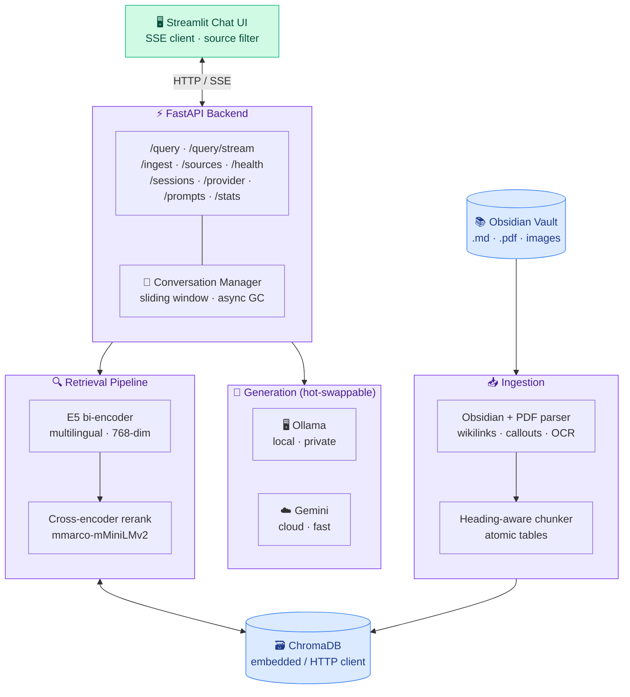

# LoreKeeper


**A production-grade RAG system for Obsidian-based tabletop-RPG worlds.**

Ask natural-language questions about your campaign — NPCs, locations, rules,
adventures, items, gods — and get grounded answers with source citations.
Runs fully local via Ollama, or in the cloud via Google Gemini. Switch
providers at runtime without a restart.

<!-- TODO: replace with real screenshot/GIF -->
<!--  -->

---

## Why LoreKeeper?

TTRPG groups accumulate hundreds of Markdown files in an Obsidian vault:
NPCs, locations, factions, rules, session notes. Generic RAG tools treat
these as flat text, miss the semantic structure Obsidian adds (wikilinks,
aliases, callouts, tags), and happily mix a rulebook class with a lore NPC
of the same name.

LoreKeeper is built from the ground up for this workflow:

- **Obsidian-native parsing** — wikilinks, `![[embeds]]`, `> [!callouts]`,
  `#tags`, and YAML frontmatter aliases are all extracted into searchable
  metadata.
- **PDF OCR & structure** — PDFs are parsed with OCR support
  (via RapidOCR), TOC-based heading hierarchy, embedded image extraction,
  and layout-aware code block suppression. Configurable per
  `ingestion.pdf` in `settings.yaml`.
- **Semantic source filtering** — every chunk inherits a `group` tag (`lore` /
  `adventure` / `rules`) from the source it was ingested from. The three UI
  toggles (🗺️ Lore, 📖 Adventure, 📋 Rules) restrict retrieval at the
  vectorstore level. Ask "What can the time mage do?" and limit to Rules, and
  you won't get the NPC named *Arkenfeld the Time Mage* polluting the context.
- **Self-service source management** — sources are defined in
  `config/sources.yaml` (folder OR single file), and the **⚙ Sources** UI page
  lets you add, edit, reindex, recategorize, or remove them without touching
  YAML. Recategorize rewrites only the metadata of existing chunks, so changing
  category mappings is a sub-second operation, not a re-embedding.
- **Two-stage retrieval with soft diversity cap** — multilingual E5
  bi-encoder for recall, cross-encoder reranker for precision, plus a
  per-source soft cap (`max_per_source`, default 3) that prevents one
  dense document from filling all top-K slots and crowding out related
  sources. The cap is two-pass: first fills with diversity preference,
  then backfills cap-blocked chunks if `top_k_rerank` would otherwise not
  be reached — diversity is a preference, never a slot-killer. Proper
  production RAG, not naive top-k cosine.
- **Honest chunking** — heading-aware splits with atomic Markdown tables,
  and small chunks only get merged with neighbors that share the same
  heading. No silent heading drift, no chunks lying about which section
  they belong to.
- **Identity-layer embedding** — filename stem + aliases are prepended to
  every chunk before embedding. A stat table with no prose self-reference
  still matches queries about its subject.
- **Dual provider** — Ollama for privacy/cost, Gemini for quality/speed.
  Switch live via a sidebar dropdown.
- **Real streaming** — SSE token stream with sources attached to the
  terminal event; multi-turn sessions with automatic GC.
- **Telegram-style answers** — the system prompt enforces scannable,
  chat-like formatting (short paragraphs, emoji headers like
  `**⚔️ Fähigkeiten**`, bullet lists, source citations) instead of flat
  prose blocks. Mobile-friendly and easy to skim during a session.
- **Live token accounting** — every assistant message shows its own
  `⬇ in · ⬆ out · 🧠 think` token usage, and the page header keeps a
  running total for the current session. Backed by a Session GC that
  resets the counter when sessions expire.

Built for German-language TTRPG content (the retrieval and LLM prompts are
in German), but the architecture is language-agnostic — swap the
multilingual E5 model and prompts for any other language.

---

## Features

| | |
|---|---|
| 🧠 **Hybrid retrieval** | E5-base bi-encoder + mMiniLMv2 cross-encoder reranker + soft per-source diversity cap (two-pass with backfill) |
| 🔀 **Dual LLM providers** | Ollama (local) ↔ Gemini (cloud), switch at runtime |
| 📜 **Obsidian-native** | Wikilinks, callouts, embeds, tags, aliases all parsed |
| 📄 **PDF OCR + structure** | RapidOCR for scanned regions, TOC-based heading hierarchy, embedded image extraction |
| 🎯 **Category filtering** | Lore / Adventure / Rules filters restrict context |
| 🌊 **SSE streaming** | Token-by-token with source citations in the done event |
| 📊 **Token accounting** | Per-message and per-session token usage (in / out / thinking), shown live in the UI |
| 💬 **Multi-turn chat** | Sliding-window memory + automatic session GC |
| 💬 **Telegram-style answers** | Scannable chat-like formatting: short paragraphs, emoji headers, bullets — instead of flat 3-line prose |
| 🔁 **Incremental indexing** | SHA-256 content hashing — only changed files re-embed |
| 🐳 **Docker-ready** | API + ChromaDB + Ollama (GPU) + UI via `docker compose` |
| ✏ **Prompt management** | Edit active prompts, save/load/compare variants, Jinja2 preview — all from the UI with instant hot-reload |
| ⚙ **Self-service setup** | Sources (folder OR single file), provider switch, and Gemini API-key entry — all from the UI, no YAML required |
| ✅ **147 tests** | Unit + integration coverage including the full HTTP layer |

---

## Architecture



Full details in [**ARCHITECTURE.md**](ARCHITECTURE.md) and
[`docs/data-flow.md`](docs/data-flow.md).

---

## Quickstart (Local)

```powershell
# 1. Virtual environment
python -m venv .venv
.venv\Scripts\activate
pip install -r requirements.txt

# 2. Pull the LLM model
ollama pull qwen3:8b

# 3. Configure
copy .env.example .env
# Create config/sources.yaml pointing at your vault(s). Each source has:
# id, path (absolute or relative), group (lore|adventure|rules), default_category,
# and optionally a category_map (folder → category, or folder → {category, group}).
#
#   sources:
#     - id: pnp-welt
#       path: C:/Users/you/Obsidian/PnP-Welt
#       group: lore
#       default_category: misc
#       category_map:
#         NPCs: npc
#         Geschichte: {category: story, group: adventure}
#         Regelwerk: {category: rules, group: rules}
#
# Sources can also be managed live in the UI under "Sources".

# 4. Start backend + UI
.\start.ps1
# or manually:
#   uvicorn src.main:app --reload --port 8000     (Terminal 1)
#   streamlit run ui/LoreKeeper.py                        (Terminal 2)

# 5. Index your vault (one-time)
python -m src.ingestion.orchestrator
```

The UI is then available at **http://localhost:8501**.

### Using Gemini instead of Ollama

1. Get an API key from [Google AI Studio](https://aistudio.google.com/apikey).
2. Provide the key — pick **one**:
   - Put `GEMINI_API_KEY=...` in `.env` (persistent across restarts), **or**
   - Paste it into the Streamlit sidebar under "LLM Provider → Gemini API-Key".
     The UI sends it to `POST /provider/gemini/key`; the backend keeps it in
     process memory only — nothing is written to disk, so it is lost on restart.
     Use this if you want a zero-config first start.
3. Set `llm.provider: gemini` in `config/settings.yaml`, or switch live from
   the Streamlit sidebar.

The sidebar shows whether a key is currently available and whether it came from
env or from UI input. The key itself is never returned by any endpoint.

---

## Docker

```bash
docker compose up --build -d
docker compose exec ollama ollama pull qwen3:8b
docker compose exec api python -m src.ingestion.orchestrator
```

In Docker, ChromaDB runs as a separate service and the API talks to it over
HTTP (`CHROMA_MODE=client`). Ollama is GPU-accelerated by default — see
`docker-compose.yaml` for the device configuration.

---

## Screenshots

<!-- TODO: add screenshots to docs/images/ and uncomment -->
<!--
| Chat with streaming response | Source filter (Lore / Adventure / Rules) |
|---|---|
|  |  |
-->

---

## Documentation

| Document | Contents |
|----------|----------|
| [ARCHITECTURE.md](ARCHITECTURE.md) | System overview, components, data flow, config schema |
| [docs/parsing.md](docs/parsing.md) | Markdown (Obsidian syntax), PDF (OCR, TOC headings, images), Image parsers |
| [docs/data-flow.md](docs/data-flow.md) | Ingestion and query pipelines (Mermaid) |
| [docs/embedding-strategy.md](docs/embedding-strategy.md) | E5 asymmetry, identity layer, reranking — and **why** |
| [docs/provider-strategy.md](docs/provider-strategy.md) | Ollama vs. Gemini, runtime switching |
| [docs/ui-ux.md](docs/ui-ux.md) | Sidebar, chat, ⚙ Sources page, ✏ Prompts page, Gemini key entry, session state, performance |
| [docs/configuration.md](docs/configuration.md) | Full `settings.yaml` reference, `sources.yaml` schema, env variables, runtime API key |
| [docs/prompts.md](docs/prompts.md) | Jinja2 templates, variables, UI editing, variant management |
| [docs/operations.md](docs/operations.md) | Ingest, re-ingest, troubleshooting |
| [docs/evaluation.md](docs/evaluation.md) | Golden Set, retrieval/end-to-end eval scripts, metrics, workflow |
| [CONTRIBUTING.md](CONTRIBUTING.md) | Dev setup, coding conventions, PR process |

---

## Tech Stack

| Layer | Technology |
|-------|------------|
| Backend | FastAPI + Pydantic v2 |
| UI | Streamlit |
| Embeddings | sentence-transformers (`intfloat/multilingual-e5-base`, 768-dim, asymmetric) |
| Reranker | sentence-transformers CrossEncoder (`cross-encoder/mmarco-mMiniLMv2-L12-H384-v1`) |
| Vector store | ChromaDB (embedded / HTTP client) |
| LLM | Ollama (`qwen3:8b`) or Google Gemini (`gemini-2.5-flash`) |
| Prompts | Jinja2 + YAML |
| OCR | RapidOCR (via `rapidocr_onnxruntime`, pure Python) |
| Tests | pytest + pytest-asyncio + httpx |

---

## Roadmap / Known Limitations

- **German-first.** Prompts and category taxonomy are German. Multilingual
  model handles the embedding side language-agnostically, but the prompt
  templates in `config/prompts.yaml` would need translation for non-German
  vaults.
- **No hybrid keyword search.** Pure vector retrieval; BM25 + vector fusion
  is on the roadmap.
- **Single-user.** No auth, no per-user sessions beyond the in-memory
  session manager. Designed for local / LAN use.
- **`.tex` files are not parsed.** Only `.md`, `.pdf`, and images.

---

## License

[MIT](LICENSE) © 2026 Fabian Hentrich
