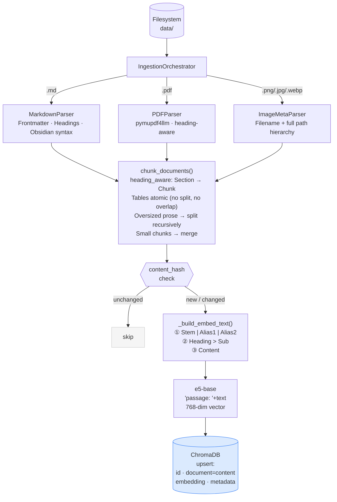
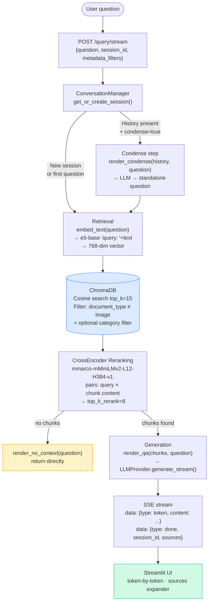
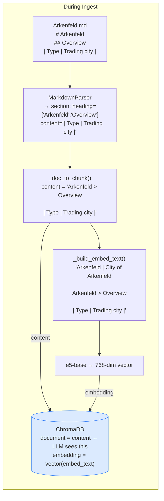
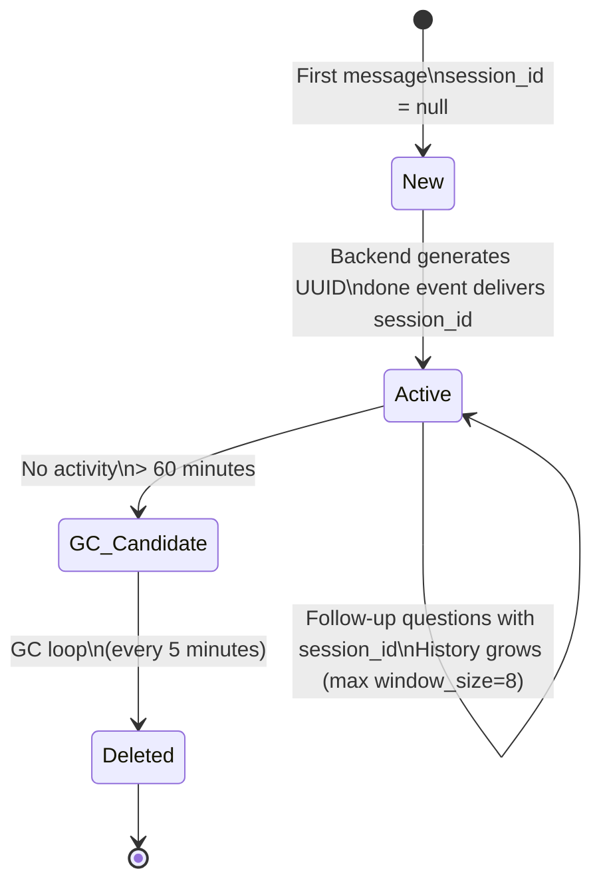
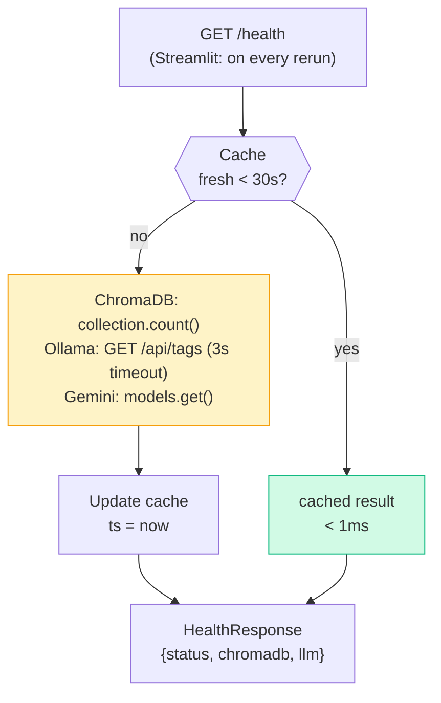

# Data Flow

## Ingestion Pipeline

**Important:** ChromaDB stores the original `content` (what the LLM sees later),
not the enriched `embed_text`.

---

## Query Pipeline

---

## Embed Text vs. Stored Content

---

## Session Lifecycle

---

## Health Check Caching

