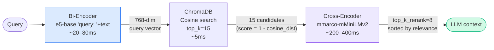
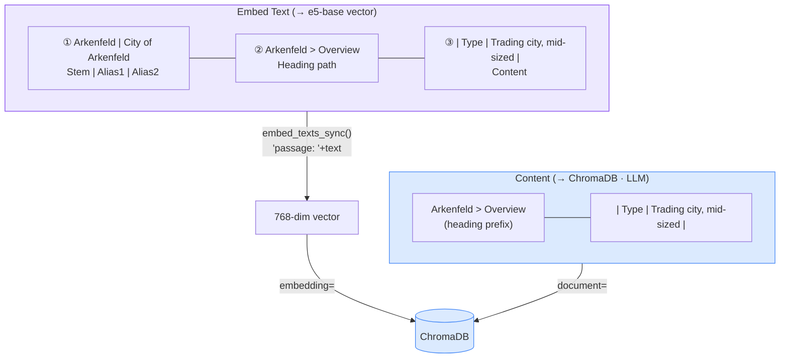

# Embedding Strategy

## Overview

LoreKeeper uses `intfloat/multilingual-e5-base` (768 dimensions, 512-token context,
cosine similarity) for all document embeddings. The model is **asymmetric**: queries
get a `"query: "` prefix, passages get a `"passage: "` prefix — this is applied
automatically by `EmbeddingService` when the model name contains `"e5"`.

There is no explicit field weighting — sentence-transformers has no concept of field
weights. The effect is achieved through **position** (earlier in the text → stronger
influence on the vector) and **repetition**.

---

## Why these choices?

The embedding stack is the single biggest quality lever in a RAG system. Each
decision below solves a concrete failure mode we hit on real TTRPG vault data.

### Why `multilingual-e5-base` (not `all-MiniLM-L6-v2` or OpenAI)?

- **The vault is German.** English-only models (MiniLM, `bge-*-en`) collapse
  German morphology into noise. Benchmarks on MIRACL/mMARCO show E5 multilingual
  beating MiniLM by 10–20 points on non-English retrieval.
- **E5 is asymmetric.** The `query: ` / `passage: ` prefixes train the model to
  represent short questions and long passages in compatible subspaces. Symmetric
  models trained on sentence-pair similarity underperform on Q→document retrieval
  because the geometry is wrong.
- **Local, free, small.** 768 dimensions, ~280 MB, runs on CPU. No API cost, no
  data leaving the machine, no rate limits during bulk ingestion of thousands of
  files.
- **Trade-off accepted:** `e5-large` would be ~2% more accurate but 3× slower and
  larger. The cross-encoder rerank (below) recovers most of that accuracy for a
  fraction of the cost.

### Why a cross-encoder rerank stage?

Bi-encoders encode query and document **separately** and compare with cosine —
fast, but the model never "sees" the pair together. This is how you get
plausible-looking top-1 hits that are actually about the wrong entity.

The cross-encoder (`mmarco-mMiniLMv2-L12-H384-v1`) encodes **both together** and
directly scores relevance. It's ~20× slower per pair, so we only run it over the
15 bi-encoder candidates, reducing to the final top 8.

In practice: the bi-encoder gets you 90% of the way on recall; the cross-encoder
fixes the ordering so the LLM's context window is used efficiently.

### Why a per-source diversity cap?

Cross-encoder scores are query-pair-relevance only — the model has no notion
of "I already picked something similar". On a high-recall query like
*"Was ist Arkenfeld?"* the bi-encoder happily returns 8 chunks all from
`Arkenfeld.md`, the reranker scores them all highly, and the LLM gets a
deep but **narrow** context: lots of Arkenfeld detail, zero from related
docs (factions, campaign structure, NPCs).

LoreKeeper applies a **`max_per_source` cap** (default `3`) after reranking,
in **two passes**:

1. **Diverse fill** — walk the score-sorted list and accept chunks until
   each source hits `max_per_source`. Cap-blocked chunks are parked in an
   `overflow` list (still in score order).
2. **Backfill** — if pass 1 produced fewer than `top_k_rerank` results
   (because the post-threshold pool was thin and dominated by one source),
   fill the remaining slots from `overflow` in score order.

The cap is therefore a **preference** for diversity, not a hard slot-killer.
The retriever never silently returns fewer chunks than `top_k_rerank` when
candidates are available — diversity is a quality goal, but starving the
LLM of context is worse. After backfill, the final list is re-sorted by
reranker score so the LLM still sees the most relevant chunks first.

This is intentionally **not** a heading-level dedupe. The `heading_aware`
chunker can legitimately produce multiple chunks under the same heading
(`chunk_index 0..N` of one long section) — discarding them as duplicates
would drop real content. The cap operates at the file level, where
crowding-out actually happens.

Tuning:

- `max_per_source: 3` (default) — good balance for an Obsidian vault with
  many small interlinked notes.
- `max_per_source: 5+` — when individual files are large and authoritative
  (e.g. a single rulebook PDF) and you'd rather pull more from one source
  than dilute with weaker matches.
- `max_per_source: 0` — disable the cap entirely; pure reranker order.

### Why the identity layer (`stem | aliases`)?

This is the trick that matters most for entity-centric TTRPG content.

A chunk like `| Type | Trading city, mid-sized |` contains no proper noun — it's
a table row. A bi-encoder embedding of just that row has zero signal for "what
is Arkenfeld?". The chunk would never surface.

Solution: **prepend the filename stem and frontmatter aliases to the embed text**
(but not the content stored in ChromaDB). The vector now carries "Arkenfeld | City
of Arkenfeld" semantics, so it matches on entity queries. The LLM still sees only
the clean content, not the hack.

Filename-as-signal works because Obsidian vaults encode entity identity in the
filename by convention. This would not work on arbitrary Markdown dumps.

### Why `heading_aware` chunking (not recursive-character)?

Obsidian documents are **semantically structured by headings**. A character sheet
has `## Stats`, `## Background`, `## Relationships`. A location doc has `## Geography`,
`## Factions`, `## Notable NPCs`.

Recursive-character chunking slices mid-paragraph or mid-table and destroys this
structure. Heading-aware chunking:

1. Splits at `#`/`##`/`###` boundaries first.
2. Keeps tables **atomic** — never splits between rows (a half-row is garbage).
   Tables stay in a single chunk up to `max_chunk_size * 3`; only very large
   tables are split at row boundaries with the header repeated.
3. Merges too-small sections **only within the same heading boundary** — a
   tiny `### Bruchgraben` table will *not* absorb the next sibling section,
   because the merged chunk would otherwise carry the wrong
   `heading_hierarchy` and silently lie about its content. Sections under
   different headings always stay separate, regardless of size.
4. Preserves the heading path (`Arkenfeld > Geography`) in the chunk body so the
   LLM sees where the content came from.

Result: each chunk is a semantically coherent unit, not a window of characters,
and its `heading_hierarchy` metadata is always truthful — which is what the
reranker's `max_per_source` cap relies on to enforce diversity across files.

### Why SHA-256 content hashing for re-ingestion?

- **Obvious alternative: file mtime.** Fails on Windows network mounts, Git
  checkouts, Dropbox/OneDrive sync (which touches mtime without changing content),
  and batch operations.
- **SHA-256 over the raw file bytes** is deterministic, portable, and cheap — a
  1 MB Markdown file hashes in ~1 ms. We cache the hash per source in ChromaDB
  metadata; on re-ingest we compute the current hash, compare, skip unchanged
  files entirely. For a 1000-file vault where 5 files changed, this turns a
  multi-minute embedding run into a sub-second operation.

### Why exclude images from retrieval?

Image "chunks" are filename stubs like `"Bild: Malek Nocthar 1 (Pfad: NPCs)"`.
They're too thin to rank well — but worse, they **pollute** top-K with near-zero
content. A hard `document_type != image` filter at the retriever level keeps them
out of the LLM context while still allowing the UI to render them when a text
chunk cites the same file (see below).

---

---

## Retrieval Pipeline



### Why two models?

| | Bi-Encoder (e5-base) | Cross-Encoder (mMiniLMv2) |
|---|---|---|
| **How it works** | Query & document encoded separately → cosine comparison | Query + document encoded together → direct interaction |
| **Advantage** | Vectors precomputed → extremely fast | Understands relationship between query and text |
| **Disadvantage** | Loses interaction context | Too slow for the full index |
| **Role** | Find candidates (top 8) | Re-rank candidates (top 5) |

---

## Embed Text Construction

For each chunk an **embed text** is constructed. ChromaDB stores the original
**content** (what the LLM sees later):



### Layer 1 — Identity
`[filename stem] | [alias 1] | [alias 2]`

- **Filename stem**: `Arkenfeld.md → "Arkenfeld"` — the most important search term
- **Aliases**: from Obsidian frontmatter (`aliases: ["City of Arkenfeld"]`) — alternative names
- **Problem without this layer:** A chunk `| Type | Trading city |` does not contain the name
  "Arkenfeld" → a search for "what is Arkenfeld?" would not find the chunk

### Layer 2 — Context
`[Heading > Subheading]` — which section of a document (embedded in content by the chunker)

### Layer 3 — Content
The actual text. Tables, prose, lists.

---

## Document Types

| Type | Embed Text Structure | In Retrieval |
|------|---------------------|:---:|
| Markdown | `Stem \| Aliases` · `Heading > Sub` · `Content` | ✅ |
| PDF | `Stem` · `Heading > Sub` · `Content` | ✅ |
| Image | — | ❌ |

**Images excluded from retrieval:** The retriever applies `document_type != image` as a
hard filter. Image stubs (`"Bild: Malek Nocthar 1 (Pfad: NPCs)"`) are too thin to rank
well and would displace content-rich chunks from the top-K slots.

**Image questions still work:** Queries like "Zeig mir ein Bild von Malek Nocthar" return
the associated `.md` file (`NPCs/Malek Nocthar.md`). The UI then renders any images
referenced in that file via `st.image()` when `document_type == "image"` is set in the
source reference. The Golden Set reflects this: image questions use `.md` as
`expected_sources`.

---

## What Is NOT in the Embedding

| Field | Why not | Instead |
|-------|---------|---------|
| `obsidian_tags` | Category signal too weak | ChromaDB metadata → sidebar filter |
| `wikilinks` | Reference graph, not a retrieval signal | ChromaDB metadata |
| `content_category` | Controllable via filter | ChromaDB metadata → sidebar filter |
| `source_path` | Absolute path, no semantic content | UI links (file://) |

---

## Re-ingest After Changes

The `content_hash` is based on the **file content**, not the generated embed text.
Changes to chunking or embed text construction therefore require a manual re-ingest:

```powershell
# Stop backend first, then:
Remove-Item -Recurse -Force .\chroma_data
python -m src.ingestion.orchestrator
```

See [operations.md](operations.md) for details.
