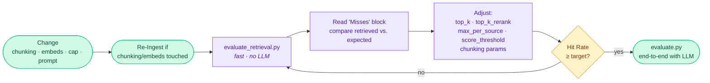

# Evaluation

This document describes the offline evaluation framework for LoreKeeper. It covers the Golden Set of test questions, the evaluation scripts for fast retrieval testing and full end-to-end (LLM) testing, target metrics, and the recommended iterative workflow.

## Table of Contents
1. [Overview](#overview)
2. [TL;DR](#tldr)
3. [The Golden Set (`evaluation/qa_pairs.yaml`)](#the-golden-set-evaluationqa_pairsyaml)
4. [`evaluate_retrieval.py` — fast loop](#evaluate_retrievalpy--fast-loop)
5. [`evaluate.py` — end-to-end](#evaluatepy--end-to-end)
6. [Metrics & targets](#metrics--targets)
7. [Workflow](#workflow)
8. [Adding new questions](#adding-new-questions)

---

## Overview

LoreKeeper ships with a Golden Set and two evaluation scripts to measure
retrieval quality without guesswork. Use them whenever you change anything
that touches retrieval — chunking, embedding, reranking, the soft cap,
prompts — to catch regressions before they bite during a session.

---

## TL;DR

```bash
# Fast loop: retrieval only, no LLM call (~20s for 116 questions)
python -m evaluation.evaluate_retrieval

# Override per-run parameters
python -m evaluation.evaluate_retrieval --top-k 25 --top-k-rerank 10

# End-to-end including the LLM (slow, requires running backend)
python -m evaluation.evaluate --qa-pairs evaluation/qa_pairs.yaml --output evaluation/results/
```

Reports are written to `evaluation/results/` as timestamped JSON.

---

## The Golden Set (`evaluation/qa_pairs.yaml`)

116 manually-curated questions covering:

| Block | Count | What it tests |
|---|---|---|
| `markdown` (m001–m025) | 25 | Entity-centric Q→file recall (NPC, location, organisation, item, enemy). Covers all major vault folders — Orte, NPCs, Organisationen, Dämonen, verlorene Magierstädte. |
| `pdf` (p001–p040) | 40 | Rulebook PDF covering all 6 chapters — Grundregeln (Ass-Regel, Kombinationswürfe), Charaktergrundlagen (Talentpunkte, Legendärer Rang), Talente, Kampfregeln (Schadenstypen, Statuseffekte, Rüstung), alle 6 nicht-magischen Klassen (Krieger, Schurke, Waldläufer, Gladiator, Mönch, Alchemist), alle 7 Magieschulen (Elementar, Tier, Zauberschmied, Golem, Dunkle, Zeit, Basisausrüstung), and 3 Eigenheiten-Kategorien. |
| `image` (i001–i010) | 10 | Image questions resolve to the **associated `.md` file** (images are excluded from retrieval — see `embedding-strategy.md`) |
| `adventure` (a001–a015) | 15 | Adventure/campaign structure, multi-act recall. Covers all 12 Söldner-Kampagnen-Abenteuer plus Weihnachts-One-Shot and Akademie-Auftragsbrief. |
| `s001–s006` **structure tests** | 6 | Sub-section recall, multi-source diversity, table atomicity, identity-layer, wikilink cross-references |
| `k001–k020` **keyword tests** | 20 | Exact-term questions designed to reward BM25 over pure vector — rare proper nouns (Rhaz'Muell, Thal'Emyra, Artheon Knisterhand Faraday), distinct compounds (Ephraskal-Handschuh, Venthir-Siegelnetz-Blaupause, Sequenz-Schlüssel), and single-color variant collisions (Blauer/Roter/Grüner Monolith). Use with the A/B run to measure hybrid lift. |

The structure tests (`s00x`) exist specifically to catch failure modes that
the entity tests miss:

| ID | Failure mode it catches |
|---|---|
| `s001` | `_merge_small_chunks` collapsing sections across heading boundaries (the bug that hid the Gotteslicht-Viertel chunk) |
| `s002` | Sub-section addressability — does heading-aware chunking actually split deep `###` sections cleanly? |
| `s003` | Multi-source recall — does `max_per_source` diversify, or does one dense file eat all slots? |
| `s004` | Table atomicity + identity layer — pure stat tables with no prose self-reference |
| `s005` | Wikilink-as-context — entities mentioned only via `[[...]]` in another file |
| `s006` | Information that lives only in a table cell, found via the identity-layer |

### Schema

```yaml
- id: m001
  question: "Wo liegt Arkenfeld und was ist das für ein Ort?"
  source_type: markdown          # markdown | pdf | image
  category: location             # label only — not stored in ChromaDB
  expected_sources:
    - "Orte/Arkenfeld.md"        # path relative to source base path
  expected_answer_contains:
    - "Arkenfeld"                # substrings the LLM answer should contain
  notes: "optional"
```

> `category` is a Golden Set label only — it has no relation to the
> `content_category` ChromaDB metadata derived from folder structure.

### A "hit" is loose by design

`evaluate_retrieval.py` counts a question as a hit if **any** of its
`expected_sources` filenames appears in the retrieved chunks. Subdirectory
prefixes are ignored (`Orte/Arkenfeld.md` matches a chunk with
`source_file == "Orte\\Arkenfeld.md"` or just `Arkenfeld.md`). This keeps
the metric stable across path-separator quirks and lets multi-source
questions be marked as hits even if only one of several expected files is
returned — the per-question `details` block in the JSON report shows
exactly what was retrieved.

---

## `evaluate_retrieval.py` — fast loop

Talks directly to the Retriever (embedding → ChromaDB → reranker → soft
cap), no LLM. Use this for every retrieval-tuning iteration.

```bash
python -m evaluation.evaluate_retrieval
python -m evaluation.evaluate_retrieval --top-k 25 --top-k-rerank 10
python -m evaluation.evaluate_retrieval --qa-pairs evaluation/qa_pairs.yaml --output evaluation/results/
```

CLI flags:

| Flag | Default | Effect |
|---|---|---|
| `--top-k` | from `settings.yaml` | Bi-encoder candidate count |
| `--top-k-rerank` | from `settings.yaml` | Final chunk count after reranking |
| `--hybrid` / `--no-hybrid` | from `settings.yaml` | Force hybrid retrieval on/off for this run, overriding `retrieval.hybrid.enabled`. Omit both to use the config default. |
| `--qa-pairs` | `evaluation/qa_pairs.yaml` | Path to the question set |
| `--output` | `evaluation/results/` | Where to write the JSON report |

For A/B comparisons, run the same Golden Set twice and diff the JSON reports:

```bash
python -m evaluation.evaluate_retrieval --no-hybrid --output evaluation/results/
python -m evaluation.evaluate_retrieval --hybrid    --output evaluation/results/
```

The Streamlit Evaluation page has a one-click equivalent: in the "Retrieval
Eval" tab, the **⚖ A/B starten (Vektor vs. Hybrid)** button runs both modes
sequentially and shows the hit-rate delta plus the list of questions where
Hybrid wins or loses. The "Frage testen" and "Retrieval Eval" tabs each
carry a three-way mode selector (Config default / Vector only / Hybrid).

> **`max_per_source` is not (yet) a CLI flag** for the eval script. To
> sweep it, edit `config/settings.yaml` (or set
> `RETRIEVAL__RERANKING__MAX_PER_SOURCE=N` in the environment) before
> running. Per-request override via the API/UI works at runtime.

Console output shows the per-`source_type` breakdown plus a `Misses`
section with the expected vs. retrieved files for every failure — read
those carefully, they tell you *why* a question failed.

---

## `evaluate.py` — end-to-end

Hits the live `/query` endpoint, so it measures the **whole** pipeline
including the LLM. Slower (one full generation per question), and the
backend has to be running.

```bash
# Terminal 1
uvicorn src.main:app --port 8000

# Terminal 2
python -m evaluation.evaluate \
    --qa-pairs evaluation/qa_pairs.yaml \
    --output evaluation/results/
```

Adds an `answer_contains` metric: how often the LLM's actual response
contains the substrings listed in `expected_answer_contains`. Use this as
a final acceptance check after the retrieval loop has stabilised.

---

## Metrics & targets

| Metric | Script | What it measures | Target |
|---|---|---|---|
| **Hit Rate@K** | `evaluate_retrieval.py` | Expected file in top-K chunks | > 0.85 |
| **Answer Contains** | `evaluate.py` | Expected keywords in LLM answer | > 0.75 |
| **Latency** | `evaluate.py` | End-to-end response time | < 10s |

The target on Hit Rate is intentionally below 1.0 — the structure tests
include questions that exercise edge cases (cross-file wikilinks, deeply
nested sections), and getting them all right is a goal, not a baseline.
Drop below 0.85 → something regressed.

---

## Workflow



**Re-ingest is only required if you changed chunking, embedding, or the
identity layer.** Reranking, soft cap, `top_k`, and prompt changes do not
need a re-ingest — the loop stays sub-minute.

---

## Adding new questions

Add an entry to `evaluation/qa_pairs.yaml` and re-run
`evaluate_retrieval.py`. Things to keep in mind:

1. **Pick the smallest meaningful `expected_sources`.** If a question
   could be answered from three files, list all of them — the hit rule is
   "any match", so this gives the retriever fair chances and the report
   shows which file was actually used.
2. **Image questions point at the `.md` file**, not the image. The
   retriever excludes `document_type == image`; the UI renders images by
   following the `.md` file's references.
3. **Add a `notes:` field** explaining *what* the question is supposed to
   stress. Future-you will thank you when a regression breaks it and you
   need to remember whether it was about table atomicity or the identity
   layer.
4. **Avoid `expected_answer_contains` for broad questions.** Leave it
   empty (`[]`) when the answer space is too wide for fixed substrings —
   `evaluate.py` then only checks retrieval, not text content.
5. **Re-run after adding** to confirm the new question hits with the
   current configuration. A new question that already misses is a
   feature request, not a regression test.
