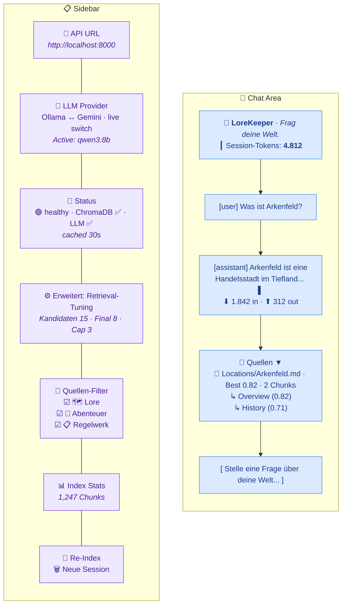
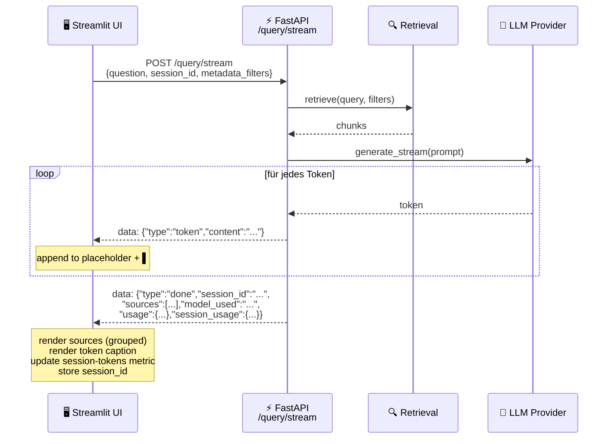

# UI / UX

## Streamlit Chat Interface



---

## Sidebar Elements

### API URL
Connection target for the backend. Default: `http://localhost:8000`.
Can be changed to a remote server without restarting.

### LLM Provider
Dropdown for switching between Ollama and Gemini at runtime.
- Switch fails → dropdown reverts + error message
- Successful switch → confirmation message

### Status Display
Result of the `/health` endpoint, **cached for 30 seconds** (no poll on every rerun).
- 🟢 healthy: ChromaDB + LLM reachable
- 🟡 degraded: One component unreachable
- 🔴 API unreachable: Backend down

### Retrieval-Tuning (Advanced Expander)
Three sliders inside `st.expander("⚙️ Erweitert: Retrieval-Tuning")`, hidden by
default to keep the sidebar uncluttered for non-tuning users:

| Slider | Range | Default | Sent as | Meaning |
|---|---|---|---|---|
| **Kandidaten (Top-K)** | 1 – 50 | 15 | `top_k` | How many chunks the bi-encoder retrieves from ChromaDB (recall pool) |
| **Finale Chunks (nach Reranking)** | 1 – `top_k` | min(8, top_k) | `top_k_rerank` | How many chunks the cross-encoder selects for the LLM prompt |
| **Max. Chunks pro Quelle (Soft-Cap)** | 0 – `top_k_rerank` | min(3, top_k_rerank) | `max_per_source` | Per-file diversity cap. `0` disables the cap (pure reranker order). Soft: backfilled if otherwise fewer than `top_k_rerank` chunks would be returned |

Defaults match `config/settings.yaml` (`retrieval.top_k: 15`,
`retrieval.reranking.top_k_rerank: 8`, `retrieval.reranking.max_per_source: 3`),
so untouched sliders mean "as configured". The second slider's `max_value`
is bound to the first, the third's to the second, which prevents the
nonsensical cases `top_k_rerank > top_k` and `max_per_source > top_k_rerank`.

The values override the server defaults per request only — they do **not**
mutate `settings.yaml`.

### Source Filter (Lore / Adventure / Rules)
Three checkbox groups that restrict the vector search by `content_category`.
Each checkbox represents a semantic group of underlying category values:

| Checkbox | Underlying `content_category` values |
|---|---|
| 🗺️ **Lore** | `npc`, `location`, `enemy`, `item`, `organization`, `daemon`, `god`, `backstory`, `misc` |
| 📖 **Abenteuer** | `story` |
| 📋 **Regelwerk** | `tool`, `rules` |

The filter solves a real disambiguation problem: a query like *"What can the
time mage do?"* could match both the rulebook class **and** an NPC named
*Arkenfeld the Time Mage*. Unchecking 🗺️ Lore restricts retrieval to the
rulebook chunks at the vectorstore level, before the LLM ever sees them.

**State semantics:**

| Selection | Filter sent to backend |
|---|---|
| All three checked | `None` (no filter) |
| Subset checked | `{"content_category": {"$in": [...selected values...]}}` |
| Nothing checked | Request blocked at chat input with `st.error` (no API call made) |

When a subset is active, the sidebar shows a "🔍 Suche eingeschränkt auf: ..."
caption listing the selected groups so the filter state stays visible during
the conversation.

The retriever combines this with the hard-coded `document_type != "image"`
filter into a ChromaDB `$and` query (`src/retrieval/retriever.py:55-66`).

### Re-index Documents
Starts an ingestion job in the backend (`POST /ingest`).
Returns a `job_id` immediately — ingestion runs asynchronously.
Progress is not visible in real time (no polling implemented).

### New Session
Clears `st.session_state.messages` and `session_id` — the next question starts
without conversation history.

---

## Header

The page header is split into two columns:

| Left | Right |
|---|---|
| `📜 LoreKeeper` title + `Frag deine Welt.` caption | **Session-Tokens metric** — total tokens consumed in the current session |

The metric on the right shows the cumulative `tokens_in + tokens_out + tokens_thinking`
of the active session, formatted with thousand separators. Hovering reveals
the breakdown via tooltip (`In: … · Out: … · Thinking: …`). The counter is
reset by the **🗑️ Neue Session** sidebar button.

---

## Chat Area

### Message Rendering
- Past messages are rendered from `st.session_state.messages`
- Each assistant message shows a token-usage caption directly below the
  answer text (`⬇ N in · ⬆ N out · 🧠 N think`, the thinking part only
  appears if non-zero)
- Sources are displayed as a collapsible `st.expander("📎 Quellen")` and
  **grouped by file** (see below)

### Streaming

Token-by-token via Server-Sent Events. A blinking `▌` cursor is appended to
the placeholder until the `done` event arrives, at which point the sources
expander is rendered and `session_id` is stored for follow-up questions.



The `done` event carries two usage payloads:

| Field | Meaning |
|---|---|
| `usage` | Tokens consumed by **this single request** (`tokens_in`, `tokens_out`, `tokens_thinking`) |
| `session_usage` | Cumulative session totals after this request, used to refresh the header metric |

### Source Display (grouped by file)

Sources are **grouped per document** in the expander, so multiple chunks from
the same file appear under one heading instead of looking like duplicates:

```
📄 Locations/Arkenfeld.md — Best Score: 0.82 · 2 Chunks
    ↳ Arkenfeld > Overview (Score: 0.82)
       Arkenfeld is a mid-sized trading city...
    ↳ Arkenfeld > History (Score: 0.71)
       Founded during the Salt Wars...
```

| Document Type | Rendering |
|---|---|
| Markdown / PDF (single chunk) | `📄 [Filename](file:///...) — Best Score: 0.82` plus chunk preview |
| Markdown / PDF (multiple chunks) | Same header with `· N Chunks` suffix; each chunk listed indented as `↳ Heading (Score)` + preview |
| Image | `st.image(source_path)` with filename as caption (rendered separately, before grouped docs) |

Links open the original file locally (e.g. in Obsidian if `.md` is associated with it).
If `source_path` does not exist, a warning is shown.

### Token Display

| Location | Source | Format |
|---|---|---|
| Below each assistant message | `usage` field of the `done` event, persisted in `messages[*].usage` | `⬇ N in · ⬆ N out · 🧠 N think` (thinking only when > 0) |
| Header metric (top right) | `session_usage` field of the `done` event, mirrored into `st.session_state.session_usage` | `Session-Tokens` metric with thousand separators and tooltip breakdown |

`tokens_thinking` is populated by Gemini 2.5 (`thoughts_token_count`) when
thinking is enabled. For Ollama with Qwen3, `/no_think` is set, so the value
is always `0` and the icon is hidden.

---

## Performance Characteristics

| Action | Latency (typical) |
|--------|------------------|
| Sidebar rerun | <100ms (cached API calls) |
| First query after server start | +2–4s (embedding model warm, ChromaDB connected) |
| Query (Ollama qwen3:8b) | 8–30s total |
| Query (Gemini 2.5 Flash) | 3–8s total |
| Reranking (8 candidates) | ~300ms |

**Embedding model** is preloaded at server start (`warmup` in lifespan) —
the first query is therefore no slower than subsequent ones.

---

## Session State Overview

| Key | Type | Meaning |
|-----|------|---------|
| `messages` | `list[dict]` | Full chat history including `sources` and per-message `usage` |
| `session_id` | `str \| None` | Backend session UUID for conversation context |
| `session_usage` | `dict` | Cumulative `{tokens_in, tokens_out, tokens_thinking}` for the active session, displayed in the header metric |
| `_selected_provider` | `str` | Currently selected provider (widget state) |
| `_provider_switch_ok` | `bool` | Temporary flag: switch succeeded |
| `_provider_switch_error` | `str` | Temporary flag: error message on switch failure |
