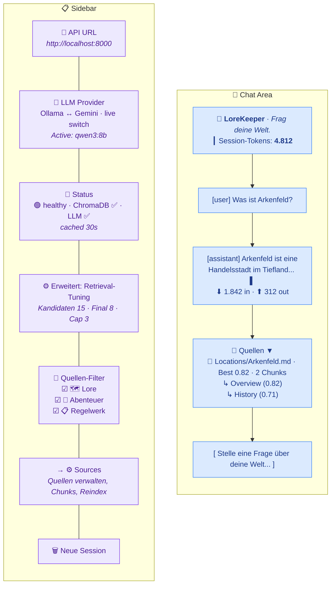
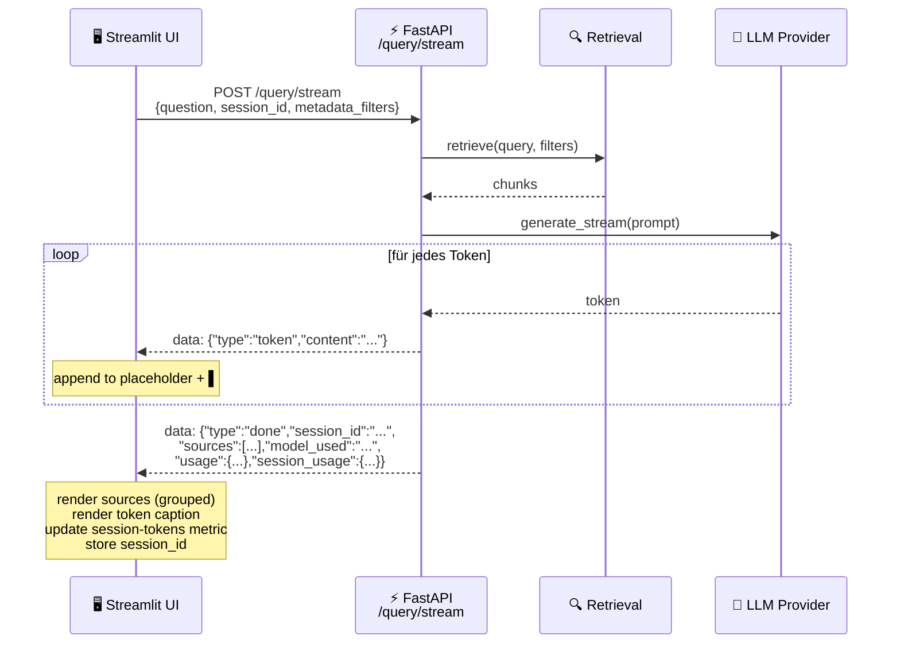

# UI / UX

## Streamlit Chat Interface



---

## Sidebar Elements

### API URL
Connection target for the backend. Default: `http://localhost:8000`.
Can be changed to a remote server without restarting.

### LLM Provider
Dropdown for switching between Ollama and Gemini at runtime.
- Switch fails → dropdown reverts + error message
- Successful switch → confirmation message

#### Gemini API Key Input

Directly below the provider selector. Calls `GET /provider/gemini/status` to
ask the backend whether a key is currently available — the endpoint never
returns the key itself, only `{has_key, source: env|runtime|none}`.

| Backend state | Sidebar shows |
|---|---|
| Key from `os.environ` / `.env` | `🔑 Gemini-Key: ✅ (Umgebungsvariable)` plus an **Override** expander |
| Key set via UI in this session | `🔑 Gemini-Key: ✅ (UI-Eingabe)` plus the same **Override** expander |
| No key | Yellow warning + password input + **Key speichern** button |

The input is `type="password"` and submits to `POST /provider/gemini/key`. The
backend stores the key in process memory only — it is **never written to disk**
and is lost on backend restart. If Gemini is the active provider, the backend
hot-rebuilds the provider + generator so the new key applies immediately;
otherwise the key just sits in memory until the user switches to Gemini.

This makes "start backend with no `.env` → paste key in UI → use Gemini" a
one-step path without touching any config files.

### Status Display
Result of the `/health` endpoint, **cached for 30 seconds** (no poll on every rerun).
- 🟢 healthy: ChromaDB + LLM reachable
- 🟡 degraded: One component unreachable
- 🔴 API unreachable: Backend down

### Retrieval-Tuning (Advanced Expander)
Three sliders inside `st.expander("⚙️ Erweitert: Retrieval-Tuning")`, hidden by
default to keep the sidebar uncluttered for non-tuning users:

| Slider | Range | Default | Sent as | Meaning |
|---|---|---|---|---|
| **Kandidaten (Top-K)** | 1 – 50 | 15 | `top_k` | How many chunks the bi-encoder retrieves from ChromaDB (recall pool) |
| **Finale Chunks (nach Reranking)** | 1 – `top_k` | min(8, top_k) | `top_k_rerank` | How many chunks the cross-encoder selects for the LLM prompt |
| **Max. Chunks pro Quelle (Soft-Cap)** | 0 – `top_k_rerank` | min(3, top_k_rerank) | `max_per_source` | Per-file diversity cap. `0` disables the cap (pure reranker order). Soft: backfilled if otherwise fewer than `top_k_rerank` chunks would be returned |

Defaults match `config/settings.yaml` (`retrieval.top_k: 15`,
`retrieval.reranking.top_k_rerank: 8`, `retrieval.reranking.max_per_source: 3`),
so untouched sliders mean "as configured". The second slider's `max_value`
is bound to the first, the third's to the second, which prevents the
nonsensical cases `top_k_rerank > top_k` and `max_per_source > top_k_rerank`.

The values override the server defaults per request only — they do **not**
mutate `settings.yaml`.

### Source Filter (Lore / Adventure / Rules)
Three checkboxes that restrict the vector search by the `group` metadata field
attached to every chunk during ingestion. The mapping is **direct** (no
hardcoded category lists in the UI):

| Checkbox | `group` value |
|---|---|
| 🗺️ **Lore** | `lore` |
| 📖 **Abenteuer** | `adventure` |
| 📋 **Regelwerk** | `rules` |

A chunk's `group` is determined by which **source** it was ingested from
(see `config/sources.yaml`, documented in [docs/configuration.md](configuration.md)).
This is the structural fix for an earlier bug where the filter had to map
to a hand-maintained list of `content_category` values — a single root-level
file (the rulebook PDF) silently fell through the mapping and was unreachable.

The filter solves a real disambiguation problem: a query like *"What can the
time mage do?"* could match both the rulebook class **and** an NPC named
*Arkenfeld the Time Mage*. Unchecking 🗺️ Lore restricts retrieval to the
rulebook chunks at the vectorstore level, before the LLM ever sees them.

**State semantics:**

| Selection | Filter sent to backend |
|---|---|
| All three checked | `None` (no filter) |
| Subset checked | `{"group": {"$in": [...selected groups...]}}` |
| Nothing checked | Request blocked at chat input with `st.error` (no API call made) |

When a subset is active, the sidebar shows a "🔍 Suche eingeschränkt auf: ..."
caption listing the selected groups so the filter state stays visible during
the conversation.

The retriever combines this with the hard-coded `document_type != "image"`
filter into a ChromaDB `$and` query (`src/retrieval/retriever.py`).

### Sources Link
A caption pointing the user to the **⚙ Sources** page for chunk statistics,
re-indexing (global and per-source), and source management. The chunk count
metric and the re-index button have been moved from the sidebar to the Sources
page to keep the sidebar focused on query-time settings.

### New Session
Clears `st.session_state.messages` and `session_id` — the next question starts
without conversation history.

---

## Header

The page header is split into two columns:

| Left | Right |
|---|---|
| `📜 LoreKeeper` title + `Frag deine Welt.` caption | **Session-Tokens metric** — total tokens consumed in the current session |

The metric on the right shows the cumulative `tokens_in + tokens_out + tokens_thinking`
of the active session, formatted with thousand separators. Hovering reveals
the breakdown via tooltip (`In: … · Out: … · Thinking: …`). The counter is
reset by the **🗑️ Neue Session** sidebar button.

---

## Chat Area

### Message Rendering
- Past messages are rendered from `st.session_state.messages`
- Each assistant message shows a token-usage caption directly below the
  answer text (`⬇ N in · ⬆ N out · 🧠 N think`, the thinking part only
  appears if non-zero)
- Sources are displayed as a collapsible `st.expander("📎 Quellen")` and
  **grouped by file** (see below)

### Streaming

Token-by-token via Server-Sent Events. A blinking `▌` cursor is appended to
the placeholder until the `done` event arrives, at which point the sources
expander is rendered and `session_id` is stored for follow-up questions.



The `done` event carries two usage payloads:

| Field | Meaning |
|---|---|
| `usage` | Tokens consumed by **this single request** (`tokens_in`, `tokens_out`, `tokens_thinking`) |
| `session_usage` | Cumulative session totals after this request, used to refresh the header metric |

### Source Display (grouped by file)

Sources are **grouped per document** in the expander, so multiple chunks from
the same file appear under one heading instead of looking like duplicates:

```
📄 Locations/Arkenfeld.md — Best Score: 0.82 · 2 Chunks
    ↳ Arkenfeld > Overview (Score: 0.82)
       Arkenfeld is a mid-sized trading city...
    ↳ Arkenfeld > History (Score: 0.71)
       Founded during the Salt Wars...
```

| Document Type | Rendering |
|---|---|
| Markdown / PDF (single chunk) | `📄 [Filename](file:///...) — Best Score: 0.82` plus chunk preview |
| Markdown / PDF (multiple chunks) | Same header with `· N Chunks` suffix; each chunk listed indented as `↳ Heading (Score)` + preview |
| Image | `st.image(source_path)` with filename as caption (rendered separately, before grouped docs) |

Links open the original file locally (e.g. in Obsidian if `.md` is associated with it).
If `source_path` does not exist, a warning is shown.

### Token Display

| Location | Source | Format |
|---|---|---|
| Below each assistant message | `usage` field of the `done` event, persisted in `messages[*].usage` | `⬇ N in · ⬆ N out · 🧠 N think` (thinking only when > 0) |
| Header metric (top right) | `session_usage` field of the `done` event, mirrored into `st.session_state.session_usage` | `Session-Tokens` metric with thousand separators and tooltip breakdown |

`tokens_thinking` is populated by Gemini 2.5 (`thoughts_token_count`) when
thinking is enabled. For Ollama with Qwen3, `/no_think` is set, so the value
is always `0` and the icon is hidden.

---

## Sources Page (`ui/pages/1_Sources.py`)

A dedicated Streamlit page (auto-discovered via the `pages/` directory) for
managing the ingestion sources defined in `config/sources.yaml` without ever
opening a YAML file. Reachable via the page selector at the top of the
sidebar.

### Sections

#### 1. Indizierte Chunks (gesamt) + Alle Dokumente neu indizieren

| Backend call | Notes |
|---|---|
| `GET /stats`, `POST /ingest` | Global chunk count and full re-ingest trigger (all sources). Moved here from the chat sidebar so all indexing concerns live on one page. |

All ingest operations (global and per-source) use **live progress polling**:
`_poll_ingest_job()` polls `GET /ingest/status/{job_id}` every 1.5 seconds and
displays the current state inside a `st.status` widget — documents processed,
chunks created/updated/deleted, and final duration. Errors from the ingest job
are shown as `st.warning` items.

#### 2. Konfigurierte Quellen

| Backend call | Notes |
|---|---|
| `GET /sources` (read), `PUT /sources` (save) | Editable `st.data_editor` table with columns *id, path, type, group, default_category, category_map*. |

- `id` and `path` are read-only in-line; `type` is auto-derived (`file` / `folder` / `missing`) from `Path.is_file/exists`.
- `category_map` is edited as compact text: `key→category` (inherits source group) or `key→category:group` (overrides group). Example: `NPCs→npc, Geschichte→story:adventure`. Parsed back into string or dict entries on save.
- **💾 Änderungen speichern** saves the edited table via `PUT /sources`. Fields the editor doesn't expose (`exclude_patterns`) are preserved from the original.
- **🔄 Neu laden** clears the cache and reruns to pick up external changes.

#### 3. Aktionen pro Quelle

Each source gets an expander (`📁 {id} — {path}`) with two sections:

**Action buttons** (three columns):

| Button | Backend call | Notes |
|---|---|---|
| 🔄 **Reindex** | `POST /sources/{id}/reindex` | Deletes + re-ingests one source. Shows live progress via `_poll_ingest_job()`. Required when content or path changed. |
| 🏷 **Recategorize (alle)** | `POST /sources/recategorize` | Rewrites only `group` / `content_category` / `source_id` metadata of existing chunks (seconds, no embedding). Applies to **all** sources, not just the current one. |
| 🗑 **Source entfernen** | `DELETE /sources/{id}` | Drops the source from the config **and** deletes its chunks. Gated behind a confirmation checkbox ("Wirklich löschen"). Shows deleted chunk count on success. |

**Ordner-Zuordnung** (folder mapping):

| Backend call | Notes |
|---|---|
| `GET /sources/{id}/folders` | Fetches the folder tree for this source and renders a second `st.data_editor` with columns *name, type, category, group*. |

The table is pre-populated from the source's current `category_map` — unmapped
folders fall back to the source-level `default_category` and `group`. The user
edits category and group per folder directly in the table, then clicks
**💾 Zuordnung speichern** which builds a new `category_map` (string entries
when group matches the source default, dict entries when it differs) and saves
all sources via `PUT /sources`. A hint reminds the user to run Recategorize
afterwards so existing chunks pick up the new values.

#### 4. Neue Source hinzufügen (scan-based workflow)

Adding a source is a multi-step process:

| Step | UI | Backend call |
|---|---|---|
| **1. Pfad eingeben und scannen** | Text input + 🔍 Scannen button | `POST /sources/scan` with `{"path": "..."}` |
| **2. Source-Einstellungen** | ID (auto-suggested from folder/file name), Default-Group dropdown, Default-Kategorie input | — |
| **3. Ordner zuordnen** (folder sources only) | `st.data_editor` with the scanned folder tree, pre-filled with the chosen defaults. User edits category/group per folder. | — |
| **4. Source hinzufügen** | ➕ button | `PUT /sources` with the appended entry |

The scan result (folder list, is-file flag) is persisted in `st.session_state`
so it survives Streamlit reruns between steps. Validation: ID must be non-empty
and unique across existing sources. On success, the scan state is cleared and
the page refreshes.

File sources skip step 3 (no subfolders to map).

#### 5. ⚠ Danger Zone

| Backend call | Notes |
|---|---|
| `POST /admin/wipe` (body `{"confirm": "DELETE"}`) | Type `DELETE` into the input as confirmation. Drops and recreates the ChromaDB collection in both embedded and client mode. |

### When to use which action

- **Pure config edit** (e.g. fix a typo in `category_map`): edit the table or folder mapping → Save → click **Recategorize**. No re-embedding.
- **Path changed / file moved / contents changed**: edit the table → Save → click **Reindex** for that source.
- **Source no longer needed**: tick the confirmation → **Source entfernen**.
- **New source**: use the scan-based workflow (step 1–4) to add and map folders, then **Reindex** the new source.
- **DB schema gone bad** (rare, e.g. after a major refactor): use the Danger Zone, then click **Alle Dokumente neu indizieren** at the top of the Sources page.

### Source identity

Every chunk carries a `source_id` metadata field equal to the source's
configured `id`. This is what makes per-source delete / reindex / recategorize
safe in a multi-source setup — collisions on `source_file` (e.g. two vaults
both containing `notes.md`) cannot cross-contaminate. Renaming the `id`
counts as creating a new source; the old chunks become orphans on the next
ingest.

---

## Performance Characteristics

| Action | Latency (typical) |
|--------|------------------|
| Sidebar rerun | <100ms (cached API calls) |
| First query after server start | +2–4s (embedding model warm, ChromaDB connected) |
| Query (Ollama qwen3:8b) | 8–30s total |
| Query (Gemini 2.5 Flash) | 3–8s total |
| Reranking (8 candidates) | ~300ms |

**Embedding model** is preloaded at server start (`warmup` in lifespan) —
the first query is therefore no slower than subsequent ones.

---

## Session State Overview

| Key | Type | Meaning |
|-----|------|---------|
| `messages` | `list[dict]` | Full chat history including `sources` and per-message `usage` |
| `session_id` | `str \| None` | Backend session UUID for conversation context |
| `session_usage` | `dict` | Cumulative `{tokens_in, tokens_out, tokens_thinking}` for the active session, displayed in the header metric |
| `_selected_provider` | `str` | Currently selected provider (widget state) |
| `_provider_switch_ok` | `bool` | Temporary flag: switch succeeded |
| `_provider_switch_error` | `str` | Temporary flag: error message on switch failure |
| `_scan_result` | `dict \| None` | Sources page: cached response from `POST /sources/scan` (survives reruns between add-source steps) |
| `_scanned_path` | `str` | Sources page: the path that was scanned (paired with `_scan_result`) |
