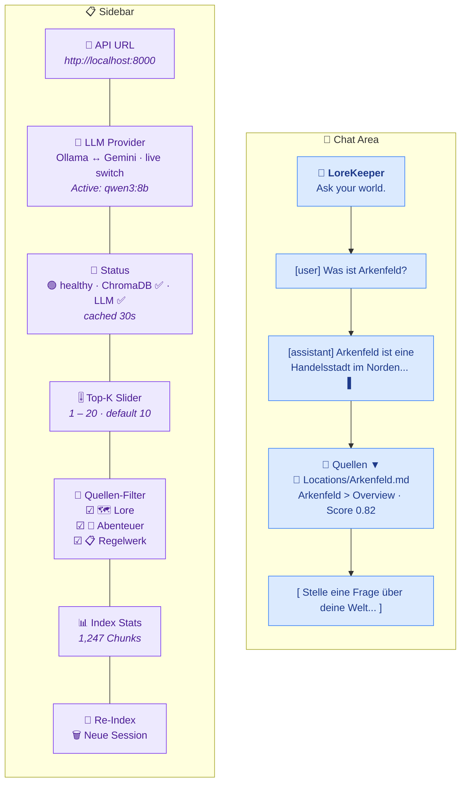
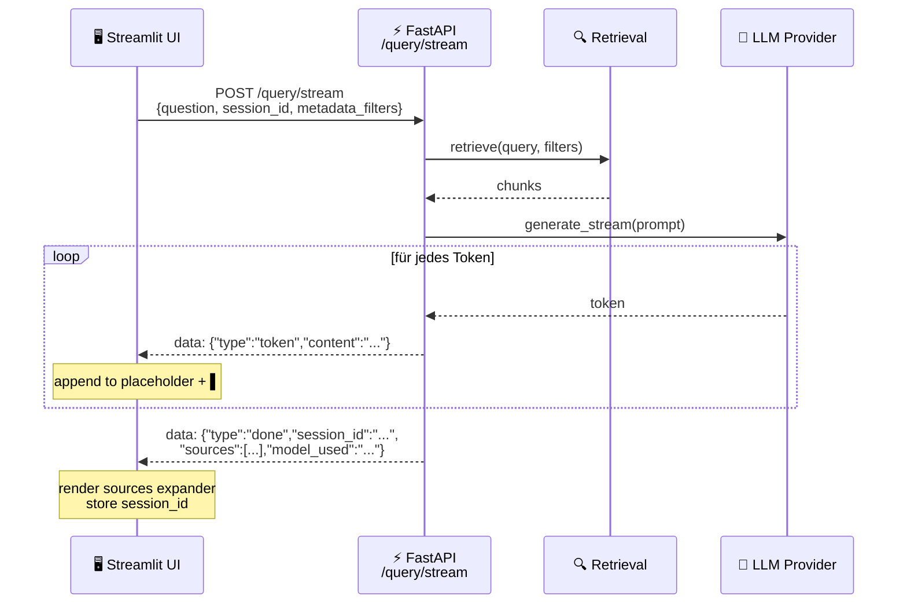

# UI / UX

## Streamlit Chat Interface

---

## Sidebar Elements

### API URL
Connection target for the backend. Default: `http://localhost:8000`.
Can be changed to a remote server without restarting.

### LLM Provider
Dropdown for switching between Ollama and Gemini at runtime.
- Switch fails → dropdown reverts + error message
- Successful switch → confirmation message

### Status Display
Result of the `/health` endpoint, **cached for 30 seconds** (no poll on every rerun).
- 🟢 healthy: ChromaDB + LLM reachable
- 🟡 degraded: One component unreachable
- 🔴 API unreachable: Backend down

### Top-K Slider
Controls how many chunks are passed as context to the LLM (after reranking).
Default: 10. This value is sent as `top_k` in the query request and overrides the server default.

### Source Filter (Lore / Adventure / Rules)
Three checkbox groups that restrict the vector search by `content_category`.
Each checkbox represents a semantic group of underlying category values:

| Checkbox | Underlying `content_category` values |
|---|---|
| 🗺️ **Lore** | `npc`, `location`, `enemy`, `item`, `organization`, `daemon`, `god`, `backstory`, `misc` |
| 📖 **Abenteuer** | `story` |
| 📋 **Regelwerk** | `tool`, `rules` |

The filter solves a real disambiguation problem: a query like *"What can the
time mage do?"* could match both the rulebook class **and** an NPC named
*Arkenfeld the Time Mage*. Unchecking 🗺️ Lore restricts retrieval to the
rulebook chunks at the vectorstore level, before the LLM ever sees them.

**State semantics:**

| Selection | Filter sent to backend |
|---|---|
| All three checked | `None` (no filter) |
| Subset checked | `{"content_category": {"$in": [...selected values...]}}` |
| Nothing checked | Request blocked at chat input with `st.error` (no API call made) |

When a subset is active, the sidebar shows a "🔍 Suche eingeschränkt auf: ..."
caption listing the selected groups so the filter state stays visible during
the conversation.

The retriever combines this with the hard-coded `document_type != "image"`
filter into a ChromaDB `$and` query (`src/retrieval/retriever.py:55-66`).

### Re-index Documents
Starts an ingestion job in the backend (`POST /ingest`).
Returns a `job_id` immediately — ingestion runs asynchronously.
Progress is not visible in real time (no polling implemented).

### New Session
Clears `st.session_state.messages` and `session_id` — the next question starts
without conversation history.

---

## Chat Area

### Message Rendering
- Past messages are rendered from `st.session_state.messages`
- Sources are displayed as a collapsible `st.expander("📎 Sources")`

### Streaming

Token-by-token via Server-Sent Events. A blinking `▌` cursor is appended to
the placeholder until the `done` event arrives, at which point the sources
expander is rendered and `session_id` is stored for follow-up questions.

### Source Display

| Document Type | Rendering |
|--------------|-----------|
| Markdown / PDF | `📄 [Filename — Heading](file:///...)` (clickable link) |
| Image | `st.image(source_path)` with filename as caption |

Links open the original file locally (e.g. in Obsidian if `.md` is associated with it).
If `source_path` does not exist, a warning is shown.

---

## Performance Characteristics

| Action | Latency (typical) |
|--------|------------------|
| Sidebar rerun | <100ms (cached API calls) |
| First query after server start | +2–4s (embedding model warm, ChromaDB connected) |
| Query (Ollama qwen3:8b) | 8–30s total |
| Query (Gemini 2.5 Flash) | 3–8s total |
| Reranking (8 candidates) | ~300ms |

**Embedding model** is preloaded at server start (`warmup` in lifespan) —
the first query is therefore no slower than subsequent ones.

---

## Session State Overview

| Key | Type | Meaning |
|-----|------|---------|
| `messages` | `list[dict]` | Full chat history including sources |
| `session_id` | `str \| None` | Backend session UUID for conversation context |
| `_selected_provider` | `str` | Currently selected provider (widget state) |
| `_provider_switch_ok` | `bool` | Temporary flag: switch succeeded |
| `_provider_switch_error` | `str` | Temporary flag: error message on switch failure |
